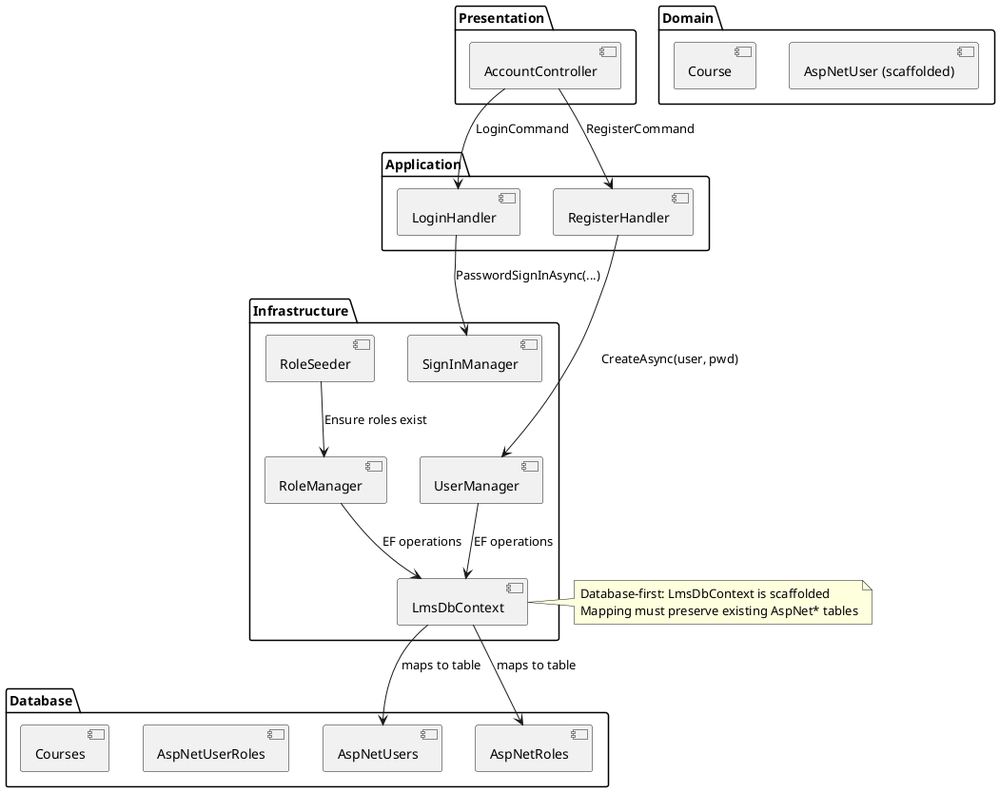
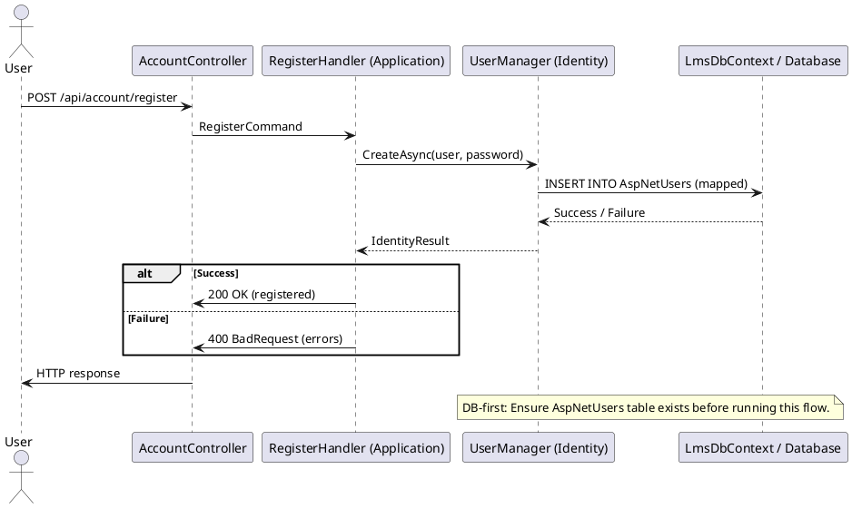
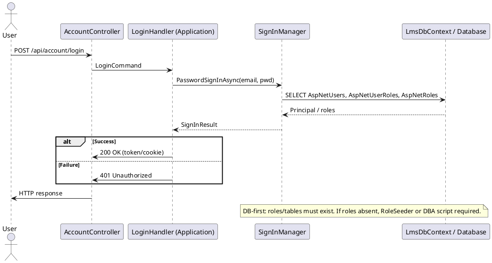
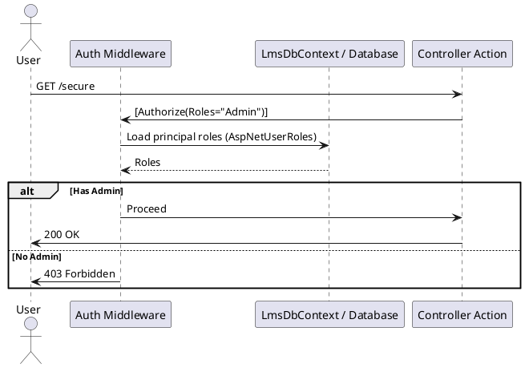
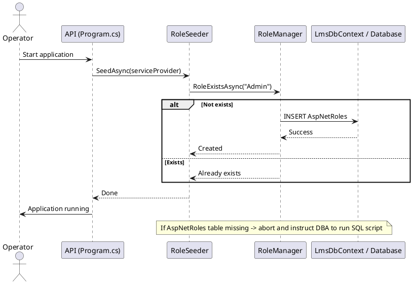

# ASP.NET Identity — Hướng dẫn thực hành (Clean Architecture, Database‑first)

Phiên bản: 1.1 — Tài liệu hướng dẫn thực hành & chia sẻ cho đồng nghiệp. Mục tiêu: bạn có thể vừa đọc vừa thực hành theo (hands‑on), đồng thời lưu trữ và chia sẻ kiến thức trong team.

---

## Mục lục (quick links)

- [Tổng quan & quyết định kiến trúc](#tổng-quan--quyết-định-kiến-trúc)
- [Chuẩn bị (prerequisites)](#chuẩn-bị-prerequisites)
- [Checklist nhanh (what you'll do)](#checklist-nhanh-what-youll-do)
- [Thực hành — Bước 1 → Bước 6 (hands‑on)](#thực-hành)
  - [Bước 1 — Kiểm tra DB & scaffolded entity](#bước-1---kiểm-tra-db--scaffolded-entity)
  - [Bước 2 — Tạo/đặt file mẫu (nếu chưa có)](#bước-2---tạotạođặt-file-mẫu-nếu-chưa-có)
  - [Bước 3 — Đăng ký Identity trong Program.cs (mapping)](#bước-3---đăng-ký-identity-trong-programcs-mapping)
  - [Bước 4 — Seed roles an toàn (RoleManager)](#bước-4---seed-roles-an-toàn-rolemanager)
  - [Bước 5 — Kiểm thử Register / Login (Swagger/Postman)](#bước-5---kiểm-thử-register--login-swaggerpostman)
  - [Bước 6 — Công việc CI / release note (migration review)](#bước-6---công-việc-ci--release-note-migration-review)
- [File & thư mục (vị trí chính xác)](#file--thư-mục-vị-trí-chính-xác)
- [Lưu ý vận hành & chia sẻ tài liệu](#lưu-ý-vận-hành--chia-sẻ-tài-liệu)
- [Appendices: Commands & snippets](#appendices-commands--snippets)

---

## Tổng quan & quyết định kiến trúc

Dự án chọn chiến lược: **database‑first** cho phần Identity. Tức là các bảng AspNet* có thể đã tồn tại (hoặc quản lý bởi DBA). Hướng này yêu cầu "mapping" code tới schema hiện hữu, không tạo migration cho các bảng Identity.

Những nguyên tắc quan trọng:
- Không tạo migration làm thay đổi bảng AspNet* khi theo database‑first.
- Dùng RoleManager để seed roles; nếu bảng roles chưa tồn tại, phối hợp với DBA bằng SQL script idempotent.
- Đăng ký Identity services trong Program.cs để nhận UserManager/SignInManager, nhưng kiểm soát strict việc tạo migration.

---

## Chuẩn bị (prerequisites)

- .NET 9 SDK cài sẵn.
- Kết nối DB trong appsettings (DefaultConnection).
- Kiểm tra: có file scaffolded AspNetUser: `LmsMini.Domain/Entities/Identity/AspNetUser.cs`.
- Các project đã reference nhau: LmsMini.Api → LmsMini.Infrastructure, LmsMini.Domain.

---

## Checklist nhanh (what you'll do)

1. Xác nhận bảng AspNetUsers tồn tại trên DB.
2. Tạo hoặc kiểm tra các file mẫu (ApplicationUser wrapper, AccountController, DTOs, RoleSeeder).
3. Đăng ký Identity trong Program.cs (mapping đến LmsDbContext hiện hữu).
4. Chạy RoleSeeder (idempotent) hoặc cung cấp SQL seed cho DBA.
5. Kiểm thử Register/Login qua Swagger hoặc Postman.
6. Ghi lại quyết định trong SDD và lưu SQL scripts vào docs/identity/sql/.

---

## Thực hành

Các bước dưới đây là kịch bản bạn có thể thực hiện trực tiếp trong workspace.

### Bước 1 — Kiểm tra DB & scaffolded entity

- Mở file: `LmsMini.Domain/Entities/Identity/AspNetUser.cs` để xác định schema PK (có GUID hay không).
- Trên DB (local), kiểm tra:
  SELECT TABLE_NAME FROM INFORMATION_SCHEMA.TABLES WHERE TABLE_NAME LIKE 'AspNet%';
- Nếu bảng AspNetUsers tồn tại — tiếp tục. Nếu không, liên hệ DBA hoặc chuẩn bị SQL tạo bảng.

### Bước 2 — Tạo/đặt file mẫu (nếu chưa có)

Các file mẫu (đã đưa ví dụ trong tài liệu) nên ở các đường dẫn:

- LmsMini.Domain/Entities/Identity/ApplicationUser.cs — wrapper IdentityUser<Guid> (không thay đổi DB).
- LmsMini.Api/Controllers/AccountController.cs — endpoints register/login minimal.
- LmsMini.Api/DTOs/RegisterRequest.cs, LoginRequest.cs — payload DTO.
- LmsMini.Infrastructure/Services/RoleSeeder.cs — seeder idempotent.

(Nếu bạn chưa có các file này, copy từ phần `Appendices` vào file tương ứng.)

### Bước 3 — Đăng ký Identity trong Program.cs (mapping)

Mở `LmsMini.Api/Program.cs` và thêm dòng đăng ký Identity (ví dụ):

```csharp
// using Microsoft.AspNetCore.Identity;
// using LmsMini.Domain.Entities.Identity; // ApplicationUser (wrapper)
// using LmsMini.Infrastructure.Persistence; // LmsDbContext

builder.Services.AddDefaultIdentity<ApplicationUser>(options =>
{
    options.SignIn.RequireConfirmedAccount = false;
})
.AddRoles<IdentityRole<Guid>>()
.AddEntityFrameworkStores<LmsDbContext>();
```

Lưu ý: đăng ký này chỉ để nhận DI cho UserManager/SignInManager; KHÔNG chạy `dotnet ef migrations add` để tạo AspNet* vì theo database‑first ta không muốn sinh bảng này.

### Bước 4 — Seed roles an toàn (RoleManager)

- Nếu DB đã có bảng roles: gọi RoleSeeder (idempotent) tại Program.cs sau app build, trước app.Run():

```csharp
using (var scope = app.Services.CreateScope())
{
    await LmsMini.Infrastructure.Services.RoleSeeder.SeedAsync(scope.ServiceProvider);
}
```

- Nếu DB không có bảng roles: lưu SQL script idempotent vào `LmsMini.Api/docs/identity/sql/create-identity-tables.sql` và phối hợp DBA chạy script, sau đó chạy seeder.

### Bước 5 — Kiểm thử Register / Login (Swagger/Postman)

- Mở Swagger (Development) hoặc dùng Postman.
- POST /api/account/register với payload RegisterRequest → kiểm tra AspNetUsers table có record (nếu Registration bật).
- POST /api/account/login → kiểm tra SignInResult.

Ghi chú: trong môi trường database‑first, behavior của Register có thể cần kiểm tra chính sách mật khẩu (PasswordOptions) — nếu lỗi "Password does not meet requirements" hãy điều chỉnh PasswordOptions trong AddDefaultIdentity hoặc dùng mật khẩu test đủ mạnh.

### Bước 6 — Công việc CI / release note (migration review)

- Mọi migration pull request phải được review: nếu migration thay đổi AspNet* → block và thông báo DBA.
- Lưu SQL seed scripts vào docs/identity/sql/ và ghi rõ phụ thuộc: "DBA phải chạy trước seeder".

---

## File & thư mục (vị trí chính xác)

Tóm tắt đường dẫn (relative to solution):

- LmsMini.Domain/Entities/Identity/ApplicationUser.cs
- LmsMini.Domain/Entities/Identity/AspNetUser.cs (scaffolded — đọc, không sửa)
- LmsMini.Api/Controllers/AccountController.cs
- LmsMini.Api/DTOs/RegisterRequest.cs
- LmsMini.Api/DTOs/LoginRequest.cs
- LmsMini.Infrastructure/Services/RoleSeeder.cs
- LmsMini.Api/docs/identity/sql/ (nơi lưu SQL seed scripts cho DBA)

---

## Lưu ý vận hành & chia sẻ tài liệu

- Đưa link đến file này trong SDD.md: thêm mục "Identity integration — database‑first" với quyết định rõ ràng.
- Khi share với đồng nghiệp, kèm checklist và chỉ dẫn chạy local (dotnet build, kiểm tra DB, chạy app, thử endpoints).
- Không commit secrets; dùng user‑secrets cho keys.

---

## Appendices: Commands & snippets

- Tạo migration (CHỈ CHO NGHIỆP VỤ):
  dotnet ef migrations add <MigrationName> -p LmsMini.Infrastructure -s LmsMini.Api
  dotnet ef database update -p LmsMini.Infrastructure -s LmsMini.Api

- RoleSeeder snippet (call from Program.cs):

```csharp
using (var scope = app.Services.CreateScope())
{
    await LmsMini.Infrastructure.Services.RoleSeeder.SeedAsync(scope.ServiceProvider);
}
```

- SQL skeleton (đặt vào docs/identity/sql/create-identity-tables.sql và gửi DBA để apply):

```sql
-- minimal AspNetRoles + AspNetUserRoles example (DBA review required)
CREATE TABLE dbo.AspNetRoles (
    Id UNIQUEIDENTIFIER NOT NULL PRIMARY KEY,
    [Name] NVARCHAR(256) NULL,
    [NormalizedName] NVARCHAR(256) NULL,
    CONSTRAINT UQ_AspNetRoles_NormalizedName UNIQUE (NormalizedName)
);

CREATE TABLE dbo.AspNetUserRoles (
    UserId UNIQUEIDENTIFIER NOT NULL,
    RoleId UNIQUEIDENTIFIER NOT NULL,
    PRIMARY KEY (UserId, RoleId),
    FOREIGN KEY (UserId) REFERENCES dbo.AspNetUsers(Id),
    FOREIGN KEY (RoleId) REFERENCES dbo.AspNetRoles(Id)
);
```

---

## Appendices / Sequence diagrams

Below are updated diagrams (PlantUML + plain text) designed to be clearer for a database‑first implementation. Copy PlantUML blocks into a PlantUML renderer (or VS Code PlantUML extension) to visualize.

### Architecture — Component diagram (Clean Architecture mapping)




---

### Register (refined sequence)




Plain text same flow (for quick reading):
- Client → AccountController (POST /register)
- Controller → RegisterHandler (Application)
- RegisterHandler → UserManager.CreateAsync → LmsDbContext → AspNetUsers
- Return result up the chain

---

### Login (refined sequence)




---

### Authorization (Authorize attribute — simplified)




---

### Role seeding flow (idempotent)




---

All PlantUML blocks above include notes reminding that project uses database‑first and that AspNet* tables must be present/managed by DBA. Render and include these diagrams in internal docs or SDD for better team understanding.

