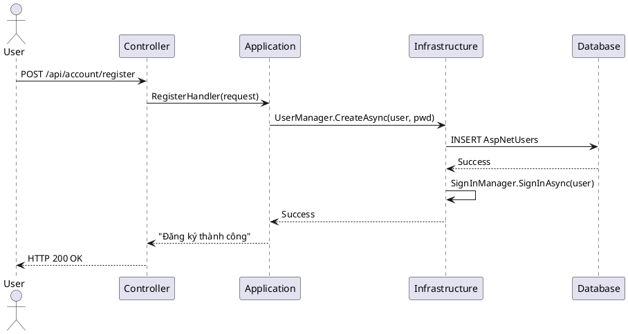
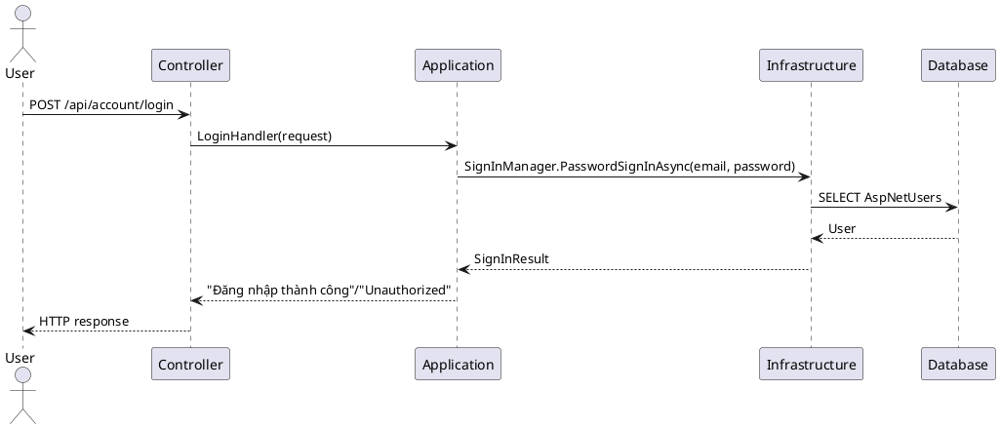

# ASP.NET Identity — Hướng dẫn triển khai (Clean Architecture, phù hợp Sprint 2)

## Mục lục

- [Giới thiệu](#giới-thiệu)
- [Yêu cầu trước khi bắt đầu](#yêu-cầu-trước-khi-bắt-đầu)
- [Tổng quan (nhiệm vụ chính)](#tổng-quan-nhiệm-vụ-chính)
- [Mapping: Identity ↔ Clean Architecture](#mapping-identity-↔-clean-architecture)
- [1. Đăng ký Identity trong Program.cs](#1-đăng-ký-identity-trong-programcs)
- [2. ApplicationUser / mapping (Domain)](#2-applicationuser--mapping-domain)
- [3. Cập nhật DbContext (Infrastructure)](#3-cập-nhật-dbcontext-infrastructure)
- [4. Migrations & Database](#4-migrations--database)
- [5. Seed roles và admin user (idempotent)](#5-seed-roles-và-admin-user-idempotent)
- [6. Register / Login (ví dụ)](#6-register--login-ví-dụ)
- [7. Test nhanh](#7-test-nhanh)
- [8. Lỗi thường gặp & cách xử lý](#8-lỗi-thường-gặp--cách-xử-lý)
- [Next steps & tham chiếu](#next-steps--tham-chiếu)
- [Appendices / Sequence diagrams](#appendices--sequence-diagrams)

---

## Giới thiệu

Tài liệu này tóm tắt các bước cần thiết để tích hợp ASP.NET Core Identity vào codebase LmsMini (Clean Architecture). Nội dung phù hợp với mục tiêu Sprint 2: đăng ký Identity trong Program.cs, tạo migration, seed roles, và tạo skeleton Register/Login để kiểm thử.

## Yêu cầu trước khi bắt đầu

- .NET 9 SDK.
- Project structure: LmsMini.Api, LmsMini.Application, LmsMini.Domain, LmsMini.Infrastructure.
- Chuỗi kết nối (DefaultConnection) đã cấu hình trong appsettings hoặc user-secrets.
- Lưu ý: repo hiện có entity scaffolded `AspNetUser` tại `LmsMini.Domain/Entities/Identity/AspNetUser.cs` (sử dụng Guid PK). Nếu đang dùng database-first (scaffold), cân nhắc mapping thay vì tạo migration trùng lặp.

## Tổng quan (nhiệm vụ chính)

1. Đăng ký Identity trong Program.cs.
2. Quyết định model user: map tới scaffolded AspNetUser hoặc tạo ApplicationUser : IdentityUser<Guid> và map bảng.
3. Cập nhật DbContext để kế thừa IdentityDbContext.
4. Tạo migration (nếu áp dụng) và apply.
5. Seed roles (Admin/Instructor/Learner) idempotent.
6. Tạo minimal Register/Login endpoints để kiểm tra.

## Mapping: Identity ↔ Clean Architecture

Để rõ ràng cho team, dưới đây là bảng mapping giữa các thành phần Identity và vị trí/điểm đăng ký trong kiến trúc Clean Architecture của repo.

| Thành phần Identity | Thuộc layer | Vị trí / Ghi chú (file/đăng ký) |
|---|---|---|
| ApplicationUser / AspNetUser | Domain | LmsMini.Domain/Entities — nếu scaffolded dùng `AspNetUser` (Guid Id); nếu code-first tạo `ApplicationUser : IdentityUser<Guid>` và map tên bảng nếu cần. |
| LmsDbContext (IdentityDbContext) | Infrastructure | LmsMini.Infrastructure/Persistence (LmsDbContext). Đăng ký DbContext trong Program.cs với AddDbContext<LmsDbContext>(). |
| UserManager<TUser>, SignInManager<TUser>, RoleManager<TRole> | Infrastructure (DI) | Được đăng ký khi gọi AddDefaultIdentity/AddIdentity trong Program.cs. Không cần AddScoped thủ công. |
| AccountController (endpoints) | Presentation | LmsMini.Api/Controllers — sử dụng UserManager/SignInManager; controller nằm ở presentation layer và gọi Application layer hoặc handlers. |
| JwtService (token service) | Infrastructure/Services | Nếu dùng JWT, implement trong LmsMini.Infrastructure/Services và đăng ký trong Program.cs (AddSingleton/AddScoped). |
| RoleSeeder / Seed runner | Infrastructure (khởi động) | Snippet gọi trong Program.cs (CreateScope). Đảm bảo idempotent. |
| EF Migrations | Infrastructure project | Migrations tạo trong LmsMini.Infrastructure; chạy với dotnet ef -p LmsMini.Infrastructure -s LmsMini.Api. |

Ghi chú ngắn:
- Nếu dự án dùng database-first (scaffold), tránh tạo migration trùng; thay vào đó map các lớp Domain tới bảng đã có.
- Đăng ký Identity và Authentication (JWT) luôn nằm trong Program.cs của project Presentation (LmsMini.Api) để khởi tạo middleware và DI.

## 1. Đăng ký Identity trong Program.cs

Thêm dịch vụ Identity và EntityFramework stores. Ví dụ:

```csharp
// using Microsoft.AspNetCore.Identity;
// using LmsMini.Domain.Entities.Identity; // ApplicationUser hoặc mapping class
// using LmsMini.Infrastructure.Persistence; // LmsDbContext

builder.Services.AddDefaultIdentity<ApplicationUser>(options =>
{
    options.SignIn.RequireConfirmedAccount = false;
    // cấu hình Password/Lockout nếu cần
})
.AddRoles<IdentityRole<Guid>>()
.AddEntityFrameworkStores<LmsDbContext>();

// NOTE: UserManager/SignInManager/RoleManager được đăng ký bởi Identity; không cần AddScoped thủ công.
```

Nếu dùng JWT, cấu hình Authentication/JwtBearer tiếp sau bước này (signing key từ user-secrets).

## 2. ApplicationUser / mapping (Domain)

Hai lựa chọn:

- Nếu muốn dùng Identity types: tạo ApplicationUser kế thừa IdentityUser<Guid>.

```csharp
public class ApplicationUser : IdentityUser<Guid>
{
    public string? FullName { get; set; }
}
```

- Nếu đã scaffold bảng AspNetUsers (database-first) và có lớp `AspNetUser` trong Domain, phương án an toàn hơn là map `ApplicationUser` hoặc cấu hình Identity để sử dụng lớp scaffolded. Trong trường hợp này, đừng tạo migration mới trừ khi bạn thực sự chuyển sang code-first.

Ghi chú: repository hiện có `LmsMini.Domain.Entities.AspNetUser` (Guid Id). Document phải tương ứng với chiến lược của team.

## 3. Cập nhật DbContext (Infrastructure)

DbContext nên kế thừa IdentityDbContext nếu bạn dùng Identity với EF stores. Ví dụ:

```csharp
public class LmsDbContext : IdentityDbContext<ApplicationUser, IdentityRole<Guid>, Guid>
{
    public LmsDbContext(DbContextOptions<LmsDbContext> options)
        : base(options) { }

    public DbSet<Course> Courses { get; set; }

    protected override void OnModelCreating(ModelBuilder builder)
    {
        base.OnModelCreating(builder);
        // cấu hình Fluent API cho entity nghiệp vụ, RowVersion, global filters...
    }
}
```

Nếu dùng scaffolded AspNetUser/AspNetRole, bạn có thể giữ lớp DbContext scaffolded và chỉ gọi base.OnModelCreating(builder) để đảm bảo mapping.

## 4. Migrations & Database

Nếu dự án sử dụng code-first cho Identity, tạo migration như sau từ solution root:

```bash
dotnet ef migrations add Init_Identity -p LmsMini.Infrastructure -s LmsMini.Api
dotnet ef database update -p LmsMini.Infrastructure -s LmsMini.Api
```

Nếu bạn đang dùng database-first (scaffold), không tạo migration trùng lặp — thay vào đó điều chỉnh mapping hoặc cập nhật scaffold.

## 5. Seed roles và admin user (idempotent)

Ví dụ snippet gọi tại khởi động (Program.cs) — chạy trong scope:

```csharp
using (var scope = app.Services.CreateScope())
{
    var roleManager = scope.ServiceProvider.GetRequiredService<RoleManager<IdentityRole<Guid>>>();
    var userManager = scope.ServiceProvider.GetRequiredService<UserManager<ApplicationUser>>();

    string[] roles = new[] { "Admin", "Instructor", "Learner" };
    foreach (var r in roles)
    {
        if (!await roleManager.RoleExistsAsync(r))
            await roleManager.CreateAsync(new IdentityRole<Guid>(r));
    }

    // (Option) seed admin user idempotent: check by email, create with strong password and AddToRoleAsync
}
```

## 6. Register / Login (ví dụ)

Minimal AccountController sample (Presentation layer). Đây là ví dụ để kiểm thử end-to-end — trong production nên dùng MediatR/handlers và validation.

```csharp
[ApiController]
[Route("api/[controller]")]
public class AccountController : ControllerBase
{
    private readonly UserManager<ApplicationUser> _userManager;
    private readonly SignInManager<ApplicationUser> _signInManager;

    public AccountController(UserManager<ApplicationUser> userManager, SignInManager<ApplicationUser> signInManager)
    {
        _userManager = userManager;
        _signInManager = signInManager;
    }

    [HttpPost("register")]
    public async Task<IActionResult> Register([FromBody] RegisterRequest request)
    {
        var user = new ApplicationUser { UserName = request.Email, Email = request.Email, FullName = request.FullName };
        var result = await _userManager.CreateAsync(user, request.Password);
        if (!result.Succeeded) return BadRequest(result.Errors);

        // optional: assign role
        if (!string.IsNullOrWhiteSpace(request.Role))
        {
            // ensure role exists and add to role (in this sample assume RoleManager available)
        }

        await _signIn_manager.SignInAsync(user, isPersistent: false);
        return Ok(new { message = "Đăng ký thành công" });
    }

    [HttpPost("login")]
    public async Task<IActionResult> Login([FromBody] LoginRequest request)
    {
        var result = await _signInManager.PasswordSignInAsync(request.Email, request.Password, request.RememberMe, lockoutOnFailure: false);
        if (!result.Succeeded) return Unauthorized(new { message = "Sai thông tin đăng nhập" });
        return Ok(new { message = "Đăng nhập thành công" });
    }
}
```

DTOs:

```csharp
public class RegisterRequest { public string Email { get; set; } = string.Empty; public string FullName { get; set; } = string.Empty; public string Password { get; set; } = string.Empty; public string? Role { get; set; } }
public class LoginRequest { public string Email { get; set; } = string.Empty; public string Password { get; set; } = string.Empty; public bool RememberMe { get; set; } = false; }
```

Ghi chú: sửa _signIn_manager -> _signInManager nếu cần; ví dụ trên giữ cấu trúc logic, bạn có thể chuyển vào Application Layer (handlers) theo CQRS.

## 7. Test nhanh

- Sau khi khởi động: sử dụng Swagger/Postman gọi POST /api/account/register và POST /api/account/login.
- Kiểm tra bảng AspNetUsers, AspNetRoles, AspNetUserRoles trong DB để xác nhận dữ liệu.

## 8. Lỗi thường gặp & cách xử lý

- No database provider has been configured: chưa cấu hình UseSqlServer/Db provider trong Program.cs hoặc connection string sai.
- Password does not meet requirements: điều chỉnh PasswordOptions trong AddDefaultIdentity hoặc dùng mật khẩu đủ mạnh.
- Migration trùng lặp khi scaffolded DB: nếu DB đã có bảng AspNet*, tránh tạo migration trùng; sử dụng mapping thay vì code-first migration.

## Next steps & tham chiếu

- Checklist Sprint 2 (ngắn):
  - Đăng ký Identity trong Program.cs.
  - Tạo migration Init_Identity (nếu code-first).
  - Seed roles + admin.
  - Tạo minimal Register/Login endpoints và unit tests.
  - Tạo JwtService skeleton nếu dùng JWT.

- Tham chiếu nội bộ: docs/architecture/CleanArchitecture.md, docs/sprints/Sprint2_2025-09-15_to_2025-09-28.md

## Appendices / Sequence diagrams

Below are sequence diagrams and PlantUML sources for common Identity flows used in this guide. You can copy the PlantUML blocks into a PlantUML renderer to visualize them.

### Luồng Đăng ký (Register) — Plain text

```plaintext
User
  |
  | 1. POST /api/account/register (email, password, fullname)
  v
[AccountController]
  |
  | 2. Controller -> Application (RegisterHandler) : RegisterCommand
  v
[Application Layer]
  |
  | 3. RegisterHandler -> Infrastructure : UserManager.CreateAsync(user, password)
  v
[Infrastructure: Identity + LmsDbContext]
  |
  | 4. EF Core -> Database : INSERT AspNetUsers
  v
[Database]
  |
  | 5. Database -> Infrastructure : Success
  ^
[Infrastructure]
  |
  | 6. If success -> SignInManager.SignInAsync(user)
  v
[Infrastructure]
  |
  | 7. Handler -> Controller : Result
  v
[AccountController]
  |
  | 8. Controller -> User : HTTP 200 OK (Đăng ký thành công)
```

### Luồng Đăng ký (Register) — PlantUML



---

### Luồng Đăng nhập (Login) — Plain text

```plaintext
User
  |
  | 1. POST /api/account/login (email, password)
  v
[AccountController]
  |
  | 2. Controller -> Application (LoginHandler) : LoginCommand
  v
[Application Layer]
  |
  | 3. LoginHandler -> Infrastructure : SignInManager.PasswordSignInAsync(email, password)
  v
[Infrastructure: Identity + LmsDbContext]
  |
  | 4. EF Core -> Database : SELECT AspNetUsers WHERE Email=..
  v
[Database]
  |
  | 5. Database -> Infrastructure : User + Roles
  ^
[Infrastructure]
  |
  | 6. Infrastructure -> Application : SignInResult
  |
  | 7. Application -> Controller : Return token/cookie or Unauthorized
  v
Controller -> User : HTTP 200 OK (or 401)
```

### Luồng Đăng nhập (Login) — PlantUML



---

### Luồng kiểm tra phân quyền (Authorize - Roles)

```plaintext
User
  |
  | 1. GET /api/secure (requires [Authorize(Roles="Admin")])
  v
[Web Server / Middleware]
  |
  | 2. Authentication middleware reads token/cookie and validates
  v
[Auth Handler]
  |
  | 3. Auth -> Infrastructure : Load user + roles (AspNetUsers, AspNetUserRoles, AspNetRoles)
  v
[Infrastructure]
  |
  | 4. Infrastructure -> Database : SELECT user roles
  v
[Database]
  |
  | 5. Database -> Infrastructure : roles
  ^
[Infrastructure]
  |
  | 6. Authorization middleware checks role "Admin"
  |   - If has role: continue to Controller
  |   - Else: return 403 Forbidden
```

### Luồng kiểm tra phân quyền (Authorize) — PlantUML


---

If you want additional diagrams or to split PlantUML into separate files under docs/appendices/plantuml/, tell me and I will add them.

