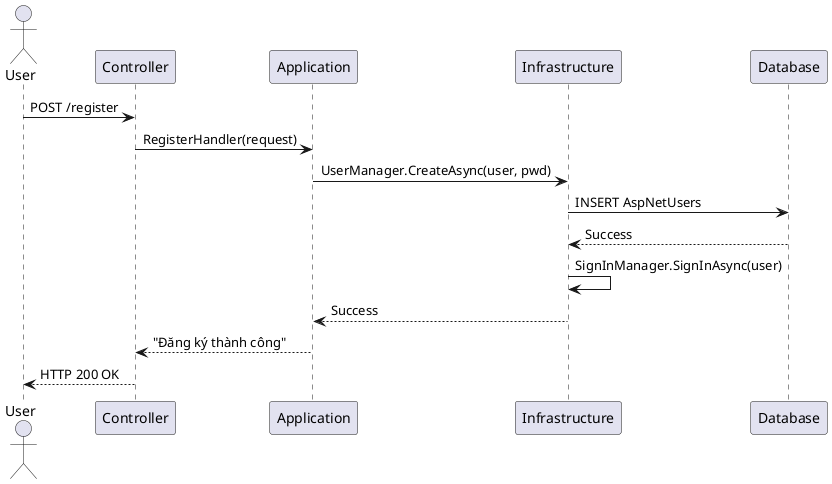
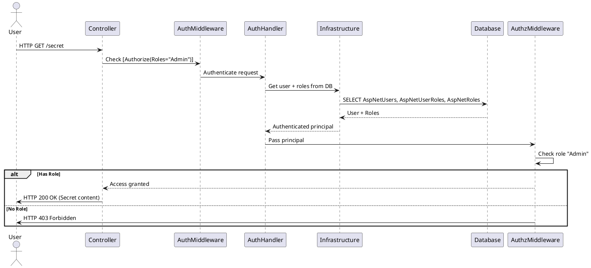

# Table of Contents

- [Giới thiệu](#giới-thiệu)
- [Kiến trúc tổng thể](#kiến-trúc-tổng-thể)
  - [Các Layer](#các-layer)
  - [Nguyên tắc phụ thuộc](#nguyên-tắc-phụ-thuộc)
- [Sơ đồ luồng xử lý](#sơ-đồ-luồng-xử-lý)
- [Tích hợp ASP.NET Identity](#tích-hợp-aspnet-identity)
  - [Cấu hình trong Program.cs](#cấu-hình-trong-programcs)
  - [Tạo lớp ApplicationUser (Domain Layer)](#tạo-lớp-applicationuser-domain-layer)
  - [Cập nhật ApplicationDbContext (Infrastructure Layer)](#cập-nhật-applicationdbcontext-infrastructure-layer)
- [Migration & Database](#migration--database)
- [Thực hành các chức năng cơ bản](#thực-hành-các-chức-năng-cơ-bản)
  - [Đăng ký người dùng (Presentation Layer)](#đăng-ký-người-dùng-presentation-layer)
  - [Đăng nhập](#đăng-nhập)
  - [Tạo Role và gán cho User](#tạo-role-và-gán-cho-user)
- [Phân quyền trong Controller](#phân-quyền-trong-controller)
- [Test nhanh](#test-nhanh)
  - [Swagger / Postman](#swagger--postman)
  - [Razor Page mặc định](#razor-page-mặc-định)
- [Lỗi thường gặp & cách xử lý](#lỗi-thường-gặp--cách-xử-lý)
- [Liên kết tới Clean Architecture](#liên-kết-tới-clean-architecture)
- [Tài liệu tham khảo](#tài-liệu-tham-khảo)
- [Sơ đồ Sequence chi tiết](#sơ-đồ-sequence-chi-tiết)
  - [Luồng Đăng ký (Register)](#luồng-đăng-ký-register)
  - [Luồng Đăng nhập (Login)](#luồng-đăng-nhập-login)
- [Sơ đồ Sequence - Chức năng Phân quyền (Authorize)](#sơ-đồ-sequence---chức-năng-phân-quyền-authorize)
  - [Luồng kiểm tra quyền truy cập với Authorize(Roles = "Admin")](#luồng-kiểm-tra-quyền-truy-cập-với-authorizeroles--admin)
  - [PlantUML — Kiểm tra phân quyền (Authorize)](#plantuml--kiểm-tra-phân-quyền-authorize)
- [Ví dụ mã nguồn đầy đủ (AccountController, DTOs, Handlers)](#ví-dụ-mã-nguồn-đầy-đủ-accountcontroller-dtos-handlers)
  - [AccountController.cs (Presentation Layer)](#accountcontrollercs-presentation-layer)
  - [DTOs (Requests)](#dtos-requests)
  - [Handlers / Services (Application Layer)](#handlers--services-application-layer)

# ASP.NET Identity - Hướng Dẫn Thực Hành (Clean Architecture + Scaffold DB)
## Giới thiệu
ASP.NET Identity là hệ thống quản lý người dùng tích hợp sẵn trong ASP.NET Core, hỗ trợ:
- Đăng ký / Đăng nhập
- Quản lý vai trò (Role) và quyền (Claim)
- Bảo mật mật khẩu, xác thực hai bước (2FA)
- Lưu trữ thông tin người dùng qua Entity Framework Core

Tài liệu này hướng dẫn triển khai ASP.NET Identity trong dự án **Clean Architecture** đã có sẵn cấu trúc và entity từ **scaffolding DB**.
## Kiến trúc tổng thể
## Các Layer
| Layer | Nhiệm vụ | Ví dụ |
|-------|----------|-------|
| **Domain** | Entity thuần (POCO), interface nghiệp vụ | `Course.cs`, `ICourseRepository.cs` |
| **Application** | Use case, service, DTO, validation | `CreateCourseHandler.cs` |
| **Infrastructure** | DbContext, EF mapping, repository implementation, Identity config | `ApplicationDbContext.cs`, `CourseRepository.cs` |
| **Presentation** | Controller, API endpoint, Razor Pages | `CourseController.cs` |
## Nguyên tắc phụ thuộc
- **Presentation** → **Application** → **Domain**
- **Infrastructure** triển khai interface từ **Domain**, được inject vào **Application**
## Sơ đồ luồng xử lý

[UI / Client] ↓ [Controller / API Endpoint] (Presentation Layer) ↓ [Service / Handler / Use Case] (Application Layer) ↓ [Repository Interface] (Domain Layer) ↓ [Repository Implementation + DbContext] (Infrastructure Layer) ↓ [Database]
## Tích hợp ASP.NET Identity
## Cấu hình trong Program.cs

```csharp
builder.Services.AddDefaultIdentity<ApplicationUser>(options =>
    options.SignIn.RequireConfirmedAccount = false)
    .AddRoles<IdentityRole>()
    .AddEntityFrameworkStores<ApplicationDbContext>();

// Cấu hình dịch vụ Identity
builder.Services.AddScoped<UserManager<ApplicationUser>>();
builder.Services.AddScoped<SignInManager<ApplicationUser>>();
builder.Services.AddScoped<RoleManager<IdentityRole>>();
```

ApplicationUser kế thừa IdentityUser để mở rộng thông tin người dùng.
## Tạo lớp Application User (Domain Layer)
```csharp
{
    public string FullName { get; set; }
}
```
### 3 Cập nhật`ApplicationDbContext`(Infrastructure Layer)
```csharp
    public class ApplicationDbContext : IdentityDbContext<ApplicationUser>
    {
        public ApplicationDbContext(DbContextOptions<ApplicationDbContext> options)
            : base(options) { }

        public DbSet<Course> Courses { get; set; }

        protected override void OnModelCreating(ModelBuilder builder)
        {
            base.OnModelCreating(builder);
            // Fluent API config cho entity khác
        }
    }
   ```
## Migration & Database
------------------------
```bash
dotnet ef migrations add InitialIdentity
dotnet ef database update
```
**Kết quả**: DB có các bảng`AspNetUsers`,`AspNetRoles`,`AspNetUserRoles`, … cùng với bảng nghiệp vụ scaffold từ DB.

## Thực hành các chức năng cơ bản
## Đăng ký người dùng (Presentation Layer)
    [HttpPost]
    public async Task<IActionResult> Register(RegisterRequest request)
    {
        var user = new ApplicationUser
        {
            UserName = request.Email,
            Email = request.Email,
            FullName = request.FullName
        };

        var result = await _userManager.CreateAsync(user, request.Password);

        if (result.Succeeded)
        {
            await _signInManager.SignInAsync(user, isPersistent: false);
            return Ok("Đăng ký thành công");
        }

        return BadRequest(result.Errors);
    }
## Đăng nhập
```csharp
public async Task<IActionResult> Login(LoginRequest request)
{
    var result = await _signInManager.PasswordSignInAsync(
        request.Email, request.Password, false, false);
        if (result.Succeeded)
            return Ok("Đăng nhập thành công");
        return Unauthorized("Sai thông tin đăng nhập");
}
```
### 3 Tạo Role và gán cho User```csharp
    public async Task<IActionResult> CreateRole(string roleName)
    {
        if (!await _roleManager.RoleExistsAsync(roleName))
            await _roleManager.CreateAsync(new IdentityRole(roleName));

        return Ok();
    }

    public async Task<IActionResult> AddUserToRole(string email, string roleName)
    {
        var user = await _userManager.FindByEmailAsync(email);
        if (user != null)
            await _userManager.AddToRoleAsync(user, roleName);

        return Ok();
    }
## Phân quyền trong Controller
-------------------------------
```csharp
[Authorize(Roles = "Admin")]
[HttpGet("secret")]
public IActionResult SecretArea()
{
    return Ok("Chỉ Admin mới thấy được");
}
```
## Test nhanh
## Swagger / Postman

*   Gọi`POST /api/account/register`→ tạo user

*   Gọi`POST /api/account/login`→ nhận token hoặc cookie

*   Gọi API có`[Authorize]`để kiểm tra phân quyền
## Razor Page mặc định

*   Truy cập`/Identity/Account/Register`và`/Identity/Account/Login`## Lỗi thường gặp & cách xử lý
-------------------------------

Lỗi

Nguyên nhân

Cách xử lý`No database provider has been configured`Chưa cấu hình connection string

Thêm`UseSqlServer`hoặc provider khác trong`Program.cs``Password does not meet requirements`Mật khẩu không đủ mạnh

Cấu hình`Password`options trong`AddDefaultIdentity`Ghi đè file Identity khi scaffold DB

Scaffold vào thư mục chứa Identity

Dùng`--output-dir`và`--context-dir`để tách riêng
## Liên kết tới Clean Architecture
------------------------------------

*   **Domain**:`ApplicationUser.cs`,`Course.cs`,`ICourseRepository.cs`*   **Application**:`CreateCourseHandler.cs`,`RegisterHandler.cs`*   **Infrastructure**:`ApplicationDbContext.cs`,`CourseRepository.cs`*   **Presentation**:`AccountController.cs`,`CourseController.cs`## Tài liệu tham khảo
-----------------------

*   Microsoft Docs - ASP.NET Core Identity

*   Entity Framework Core

*   Clean Architecture pattern
## Sơ đồ Sequence chi tiết
## Luồng Đăng ký (Register)
User

1. Gửi yêu cầu đăng ký (email, password, fullname)
  v
[Controller: AccountController]

2. Gọi Application Layer (RegisterHandler / Service)
  v
[Application Layer]

3. Tạo đối tượng ApplicationUser
4. Gọi UserManager.CreateAsync(user, password)
  v
[Infrastructure: Identity + ApplicationDbContext]

5. Lưu user vào bảng AspNetUsers
  v
[Database]

6. Trả kết quả thành công
  ^
[Infrastructure]

7. SignInManager.SignInAsync(user)
  v
[Application Layer]

8. Trả phản hồi "Đăng ký thành công"
  v
[Controller]

9. Gửi phản hồi HTTP 200 OK
  v
User
## Luồng Đăng nhập (Login)
```plantext
User
|
| 1. Gửi yêu cầu đăng nhập (email, password)
  v
[Controller: AccountController]
|
| 2. Gọi Application Layer (LoginHandler / Service)
  v
[Application Layer]
|
| 3. Gọi SignInManager.PasswordSignInAsync(email, password)
  v
[Infrastructure: Identity + ApplicationDbContext]
|
| 4. Kiểm tra thông tin trong bảng AspNetUsers
  v
[Database]
|
| 5. Trả kết quả xác thực (thành công/thất bại)
  ^
[Infrastructure]
|
| 6. Nếu thành công → tạo cookie/token
  v
[Application Layer]
|
| 7. Trả phản hồi "Đăng nhập thành công" hoặc lỗi
  v
[Controller]
|
| 8. Gửi phản hồi HTTP về cho client
  v
User
```
💡 **Ghi chú**:

*   Trong Clean Architecture:

*   **Controller** nằm ở **Presentation Layer**

*   **Handler/Service** nằm ở **Application Layer**

*   **UserManager**, **SignInManager**, **DbContext** nằm ở **Infrastructure Layer**

*   **Entity ApplicationUser** nằm ở **Domain Layer**

*   Bạn có thể dùng PlantUML để vẽ sơ đồ này đẹp hơn:

## Sơ đồ Sequence - Chức năng Phân quyền (Authorize)
## Luồng kiểm tra quyền truy cập với
```[Controller Action có [Authorize(Roles="Admin")]]```
2. Middleware Authentication (ASP.NET Core)```[Authentication Handler]```
3. Đọc cookie/token từ request
4. Xác thực danh tính (UserManager / SignInManager)```[Infrastructure: Identity + ApplicationDbContext]```
5. Lấy thông tin user + roles từ DB (AspNetUsers, AspNetUserRoles, AspNetRoles)```[Database]```
6. Trả thông tin user và roles```[Infrastructure]```
7. Middleware Authorization kiểm tra role "Admin"
- Nếu có: cho phép vào action
- Nếu không: trả 403 Forbidden```[Controller Action]```
8. Xử lý logic và trả kết quả```User```
### 2 Phiên bản PlantUML

💡 **Ghi chú**:

*   **Authentication**: Xác định bạn là ai (dựa trên cookie/token).

*   **Authorization**: Xác định bạn có quyền gì (dựa trên Role/Claim).

*   Trong Clean Architecture:

*   Middleware và Attribute`[Authorize]`nằm ở **Presentation Layer**.

*`UserManager`,`SignInManager`và truy vấn DB nằm ở **Infrastructure Layer**.

*   Quy tắc phân quyền (ví dụ role nào được phép) có thể được định nghĩa ở **Application Layer** nếu muốn tách biệt.``````

## Ví dụ mã nguồn đầy đủ (AccountController, DTOs, Handlers)

### AccountController.cs (Presentation Layer)
```csharp
using Microsoft.AspNetCore.Authorization;
using Microsoft.AspNetCore.Identity;
using Microsoft.AspNetCore.Mvc;
using System.Threading.Tasks;

namespace YourProject.Presentation.Controllers
{
    [ApiController]
    [Route("api/[controller]")]
    public class AccountController : ControllerBase
    {
        private readonly UserManager<ApplicationUser> _userManager;
        private readonly SignInManager<ApplicationUser> _signInManager;
        private readonly RoleManager<IdentityRole> _roleManager;

        public AccountController(
            UserManager<ApplicationUser> userManager,
            SignInManager<ApplicationUser> signInManager,
            RoleManager<IdentityRole> roleManager)
        {
            _userManager = userManager;
            _signInManager = signInManager;
            _roleManager = roleManager;
        }

        [HttpPost("register")]
        public async Task<IActionResult> Register([FromBody] RegisterRequest request)
        {
            if (!ModelState.IsValid) return BadRequest(ModelState);

            var user = new ApplicationUser
            {
                UserName = request.Email,
                Email = request.Email,
                FullName = request.FullName
            };

            var result = await _userManager.CreateAsync(user, request.Password);

            if (!result.Succeeded)
                return BadRequest(result.Errors);

            // Optionally add default role
            if (!string.IsNullOrWhiteSpace(request.Role))
            {
                if (!await _roleManager.RoleExistsAsync(request.Role))
                    await _roleManager.CreateAsync(new IdentityRole(request.Role));

                await _userManager.AddToRoleAsync(user, request.Role);
            }

            await _signInManager.SignInAsync(user, isPersistent: false);
            return Ok(new { message = "Đăng ký thành công" });
        }

        [HttpPost("login")]
        public async Task<IActionResult> Login([FromBody] LoginRequest request)
        {
            if (!ModelState.IsValid) return BadRequest(ModelState);

            var result = await _signInManager.PasswordSignInAsync(
                request.Email, request.Password, request.RememberMe, lockoutOnFailure: false);

            if (result.Succeeded)
                return Ok(new { message = "Đăng nhập thành công" });

            return Unauthorized(new { message = "Sai thông tin đăng nhập" });
        }

        [Authorize(Roles = "Admin")]
        [HttpGet("secret")]
        public IActionResult SecretArea()
        {
            return Ok("Chỉ Admin mới thấy được");
        }

        [HttpPost("role/create")]
        public async Task<IActionResult> CreateRole([FromBody] string roleName)
        {
            if (string.IsNullOrWhiteSpace(roleName)) return BadRequest("Role name is required.");

            if (!await _roleManager.RoleExistsAsync(roleName))
                await _roleManager.CreateAsync(new IdentityRole(roleName));

            return Ok(new { message = "Role created" });
        }

        [HttpPost("role/add")]
        public async Task<IActionResult> AddUserToRole([FromBody] AddUserRoleRequest request)
        {
            var user = await _userManager.FindByEmailAsync(request.Email);
            if (user == null) return NotFound("User not found.");

            if (!await _roleManager.RoleExistsAsync(request.Role))
                await _roleManager.CreateAsync(new IdentityRole(request.Role));

            var result = await _userManager.AddToRoleAsync(user, request.Role);
            if (!result.Succeeded) return BadRequest(result.Errors);

            return Ok(new { message = "Role assigned" });
        }
    }
}
```

### DTOs (Requests)
```csharp
public class RegisterRequest
{
    public string Email { get; set; }
    public string FullName { get; set; }
    public string Password { get; set; }
    // Optional default role to assign at registration
    public string Role { get; set; }
}

public class LoginRequest
{
    public string Email { get; set; }
    public string Password { get; set; }
    public bool RememberMe { get; set; } = false;
}

public class AddUserRoleRequest
{
    public string Email { get; set; }
    public string Role { get; set; }
}
```

### Handlers / Services (Application Layer) — ví dụ kiểu MediatR / service pattern

#### RegisterHandler.cs
```csharp
public class RegisterCommand
{
    public RegisterRequest Request { get; set; }
}

public class RegisterHandler // : IRequestHandler<RegisterCommand, Result>
{
    private readonly UserManager<ApplicationUser> _userManager;
    private readonly RoleManager<IdentityRole> _roleManager;
    // inject others (e.g., ILogger, IUnitOfWork) as needed

    public RegisterHandler(UserManager<ApplicationUser> userManager, RoleManager<IdentityRole> roleManager)
    {
        _userManager = userManager;
        _roleManager = roleManager;
    }

    public async Task<Result> Handle(RegisterCommand command)
    {
        var req = command.Request;
        var user = new ApplicationUser
        {
            UserName = req.Email,
            Email = req.Email,
            FullName = req.FullName
        };

        var createRes = await _userManager.CreateAsync(user, req.Password);
        if (!createRes.Succeeded) return Result.Failure(createRes.Errors.Select(e => e.Description));

        if (!string.IsNullOrWhiteSpace(req.Role))
        {
            if (!await _role_manager.RoleExistsAsync(req.Role))
                await _role_manager.CreateAsync(new IdentityRole(req.Role));

            await _user_manager.AddToRoleAsync(user, req.Role);
        }

        return Result.Success();
    }
}
```

> **Ghi chú:** `Result` là một lớp tiện ích đại diện cho kết quả (thành công/thất bại). Bạn có thể thay bằng `Unit` hoặc `IActionResult` tùy pattern.

---

## Sơ đồ Sequence bổ sung — Phân quyền (Authorize)

### Luồng kiểm tra quyền truy cập với `[Authorize(Roles = "Admin")]`

```plaintext
User
  |
  | 1. Gửi request tới endpoint yêu cầu quyền Admin
  v
[Controller Action có [Authorize(Roles="Admin")]]
  |
  | 2. Middleware Authentication (ASP.NET Core)
  v
[Authentication Handler]
  |
  | 3. Đọc cookie/token từ request
  | 4. Xác thực danh tính (UserManager / SignInManager)
  v
[Infrastructure: Identity + ApplicationDbContext]
  |
  | 5. Lấy thông tin user + roles từ DB (AspNetUsers, AspNetUserRoles, AspNetRoles)
  v
[Database]
  |
  | 6. Trả thông tin user và roles
  ^ 
[Infrastructure]
  |
  | 7. Middleware Authorization kiểm tra role "Admin"
  |    - Nếu có: cho phép vào action
  |    - Nếu không: trả 403 Forbidden
  v
[Controller Action]
  |
  | 8. Xử lý logic và trả kết quả
  v
User
```

### PlantUML — Kiểm tra phân quyền (Authorize)


---

