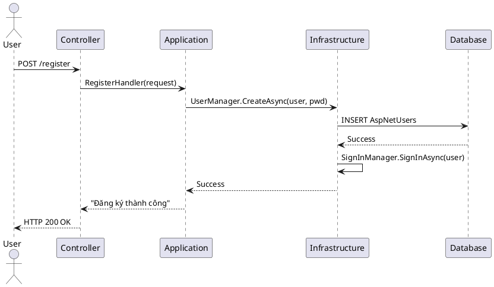
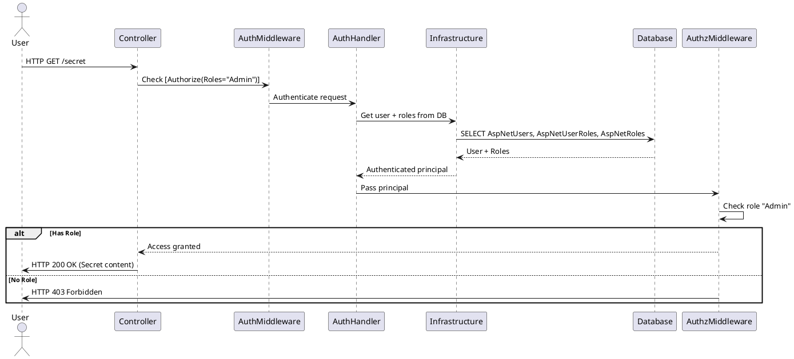

## Table of Contents

- [Giới thiệu](#giới-thiệu)
- [## Kiến trúc tổng thể](#-kiến-trúc-tổng-thể)
- [ 1 Các Layer](#1-các-layer)
- [ 2 Nguyên tắc phụ thuộc](#2-nguyên-tắc-phụ-thuộc)
- [## Sơ đồ luồng xử lý](#-sơ-đồ-luồng-xử-lý)
- [## Tích hợp ASP.NET Identity](#-tích-hợp-aspnet-identity)
- [ 1 Cấu hình trong `Program.cs`](#1-cấu-hình-trong-programcs)
- [ 4.2 Tạo lớp `ApplicationUser` (Domain Layer)](#42-tạo-lớp-applicationuser-domain-layer)
- [ 4.3 Cập nhật `ApplicationDbContext` (Infrastructure Layer)](#43-cập-nhật-applicationdbcontext-infrastructure-layer)
- [ 6.1 Đăng ký người dùng (Presentation Layer)](#61-đăng-ký-người-dùng-presentation-layer)
- [ 6.2 Đăng nhập](#62-đăng-nhập)
- [ 6.3 Tạo Role và gán cho User](#63-tạo-role-và-gán-cho-user)
- [ 8.1 Swagger / Postman](#81-swagger--postman)
- [ 8.2 Razor Page mặc định](#82-razor-page-mặc-định)
- [12. Sơ đồ Sequence chi tiết](#12-sơ-đồ-sequence-chi-tiết)
- [ 12.1 Luồng Đăng ký (Register)](#121-luồng-đăng-ký-register)
- [ 2 Luồng Đăng nhập (Login)](#2-luồng-đăng-nhập-login)
- [13. Sơ đồ Sequence - Chức năng Phân quyền (Authorize)](#13-sơ-đồ-sequence---chức-năng-phân-quyền-authorize)
- [ 13.1 Luồng kiểm tra quyền truy cập với `[Authorize(Roles = "Admin")]`](#131-luồng-kiểm-tra-quyền-truy-cập-với-authorizeroles--admin)
- [ 2 Phiên bản PlantUML](#2-phiên-bản-plantuml)

# ASP.NET Identity - Hướng Dẫn Thực Hành (Clean Architecture + Scaffold DB)

## Giới thiệu
ASP.NET Identity là hệ thống quản lý người dùng tích hợp sẵn trong ASP.NET Core, hỗ trợ:
- Đăng ký / Đăng nhập
- Quản lý vai trò (Role) và quyền (Claim)
- Bảo mật mật khẩu, xác thực hai bước (2FA)
- Lưu trữ thông tin người dùng qua Entity Framework Core

Tài liệu này hướng dẫn triển khai ASP.NET Identity trong dự án **Clean Architecture** đã có sẵn cấu trúc và entity từ **scaffolding DB**.
## 

## Kiến trúc tổng thể

### 1 Các Layer
| Layer | Nhiệm vụ | Ví dụ |
|-------|----------|-------|
| **Domain** | Entity thuần (POCO), interface nghiệp vụ | `Course.cs`, `ICourseRepository.cs` |
| **Application** | Use case, service, DTO, validation | `CreateCourseHandler.cs` |
| **Infrastructure** | DbContext, EF mapping, repository implementation, Identity config | `ApplicationDbContext.cs`, `CourseRepository.cs` |
| **Presentation** | Controller, API endpoint, Razor Pages | `CourseController.cs` |

### 2 Nguyên tắc phụ thuộc
- **Presentation** → **Application** → **Domain**
- **Infrastructure** triển khai interface từ **Domain**, được inject vào **Application**
## 

## Sơ đồ luồng xử lý

[UI / Client] ↓ [Controller / API Endpoint] (Presentation Layer) ↓ [Service / Handler / Use Case] (Application Layer) ↓ [Repository Interface] (Domain Layer) ↓ [Repository Implementation + DbContext] (Infrastructure Layer) ↓ [Database]
## 

## Tích hợp ASP.NET Identity

### 1 Cấu hình trong `Program.cs`
```csharp
builder.Services.AddDefaultIdentity<ApplicationUser>(options =>
    options.SignIn.RequireConfirmedAccount = false)
    .AddRoles<IdentityRole>()
    .AddEntityFrameworkStores<ApplicationDbContext>();

// Cấu hình dịch vụ Identity
builder.Services.AddScoped<UserManager<ApplicationUser>>();
builder.Services.AddScoped<SignInManager<ApplicationUser>>();
builder.Services.AddScoped<RoleManager<IdentityRole>>();

| ApplicationUser kế thừa IdentityUser để mở rộng thông tin người dùng.

### 4.2 Tạo lớp `ApplicationUser` (Domain Layer)

csharp

    public class ApplicationUser : IdentityUser
    {
        public string FullName { get; set; }
    }
    

### 4.3 Cập nhật `ApplicationDbContext` (Infrastructure Layer)

csharp

    public class ApplicationDbContext : IdentityDbContext<ApplicationUser>
    {
        public ApplicationDbContext(DbContextOptions<ApplicationDbContext> options)
            : base(options) { }
    
        public DbSet<Course> Courses { get; set; }
    
        protected override void OnModelCreating(ModelBuilder builder)
        {
            base.OnModelCreating(builder);
            // Fluent API config cho entity khác
        }
    }
    

5\. Migration & Database
------------------------

bash

    dotnet ef migrations add InitialIdentity
    dotnet ef database update
    

**Kết quả**: DB có các bảng `AspNetUsers`, `AspNetRoles`, `AspNetUserRoles`, … cùng với bảng nghiệp vụ scaffold từ DB.

6\. Thực hành các chức năng cơ bản
----------------------------------

### 6.1 Đăng ký người dùng (Presentation Layer)

csharp

    [HttpPost]
    public async Task<IActionResult> Register(RegisterRequest request)
    {
        var user = new ApplicationUser 
        { 
            UserName = request.Email, 
            Email = request.Email,
            FullName = request.FullName
        };
    
        var result = await _userManager.CreateAsync(user, request.Password);
    
        if (result.Succeeded)
        {
            await _signInManager.SignInAsync(user, isPersistent: false);
            return Ok("Đăng ký thành công");
        }
    
        return BadRequest(result.Errors);
    }
    

### 6.2 Đăng nhập

csharp

    [HttpPost]
    public async Task<IActionResult> Login(LoginRequest request)
    {
        var result = await _signInManager.PasswordSignInAsync(
            request.Email, request.Password, false, false);
    
        if (result.Succeeded)
            return Ok("Đăng nhập thành công");
    
        return Unauthorized("Sai thông tin đăng nhập");
    }
    

### 6.3 Tạo Role và gán cho User

csharp

    public async Task<IActionResult> CreateRole(string roleName)
    {
        if (!await _roleManager.RoleExistsAsync(roleName))
            await _roleManager.CreateAsync(new IdentityRole(roleName));
    
        return Ok();
    }
    
    public async Task<IActionResult> AddUserToRole(string email, string roleName)
    {
        var user = await _userManager.FindByEmailAsync(email);
        if (user != null)
            await _userManager.AddToRoleAsync(user, roleName);
    
        return Ok();
    }
    

7\. Phân quyền trong Controller
-------------------------------

csharp

    [Authorize(Roles = "Admin")]
    [HttpGet("secret")]
    public IActionResult SecretArea()
    {
        return Ok("Chỉ Admin mới thấy được");
    }
    

8\. Test nhanh
--------------

### 8.1 Swagger / Postman

*   Gọi `POST /api/account/register` → tạo user
    
*   Gọi `POST /api/account/login` → nhận token hoặc cookie
    
*   Gọi API có `[Authorize]` để kiểm tra phân quyền
    

### 8.2 Razor Page mặc định

*   Truy cập `/Identity/Account/Register` và `/Identity/Account/Login`
    

9\. Lỗi thường gặp & cách xử lý
-------------------------------

Lỗi

Nguyên nhân

Cách xử lý

`No database provider has been configured`

Chưa cấu hình connection string

Thêm `UseSqlServer` hoặc provider khác trong `Program.cs`

`Password does not meet requirements`

Mật khẩu không đủ mạnh

Cấu hình `Password` options trong `AddDefaultIdentity`

Ghi đè file Identity khi scaffold DB

Scaffold vào thư mục chứa Identity

Dùng `--output-dir` và `--context-dir` để tách riêng

10\. Liên kết tới Clean Architecture
------------------------------------

*   **Domain**: `ApplicationUser.cs`, `Course.cs`, `ICourseRepository.cs`
    
*   **Application**: `CreateCourseHandler.cs`, `RegisterHandler.cs`
    
*   **Infrastructure**: `ApplicationDbContext.cs`, `CourseRepository.cs`
    
*   **Presentation**: `AccountController.cs`, `CourseController.cs`
    

11\. Tài liệu tham khảo
-----------------------

*   Microsoft Docs - ASP.NET Core Identity
    
*   Entity Framework Core
    
*   Clean Architecture pattern

## 12. Sơ đồ Sequence chi tiết

### 12.1 Luồng Đăng ký (Register)

```plaintext
User
|
| 1. Gửi yêu cầu đăng ký (email, password, fullname)
  v
[Controller: AccountController]
|
| 2. Gọi Application Layer (RegisterHandler / Service)
  v
[Application Layer]
|
| 3. Tạo đối tượng ApplicationUser
| 4. Gọi UserManager.CreateAsync(user, password)
  v
[Infrastructure: Identity + ApplicationDbContext]
|
| 5. Lưu user vào bảng AspNetUsers
  v
[Database]
|
| 6. Trả kết quả thành công
  ^ 
[Infrastructure]
|
| 7. SignInManager.SignInAsync(user)
  v
[Application Layer]
|
| 8. Trả phản hồi "Đăng ký thành công"
  v
[Controller]
|
| 9. Gửi phản hồi HTTP 200 OK
  v
User
### 2 Luồng Đăng nhập (Login)

```plaintext

User
  |
  | 1. Gửi yêu cầu đăng nhập (email, password)
  v
[Controller: AccountController]
  |
  | 2. Gọi Application Layer (LoginHandler / Service)
  v
[Application Layer]
  |
  | 3. Gọi SignInManager.PasswordSignInAsync(email, password)
  v
[Infrastructure: Identity + ApplicationDbContext]
  |
  | 4. Kiểm tra thông tin trong bảng AspNetUsers
  v
[Database]
  |
  | 5. Trả kết quả xác thực (thành công/thất bại)
  ^ 
[Infrastructure]
  |
  | 6. Nếu thành công → tạo cookie/token
  v
[Application Layer]
  |
  | 7. Trả phản hồi "Đăng nhập thành công" hoặc lỗi
  v
[Controller]
  |
  | 8. Gửi phản hồi HTTP về cho client
  v
User


💡 **Ghi chú**:

*   Trong Clean Architecture:

*   **Controller** nằm ở **Presentation Layer**
    
*   **Handler/Service** nằm ở **Application Layer**
    
*   **UserManager**, **SignInManager**, **DbContext** nằm ở **Infrastructure Layer**
    
*   **Entity ApplicationUser** nằm ở **Domain Layer**
    
*   Bạn có thể dùng PlantUML để vẽ sơ đồ này đẹp hơn:


```

    User
|
| 1. Gửi request tới endpoint yêu cầu quyền Admin
      v
    [Controller Action có [Authorize(Roles="Admin")]]
|
| 2. Middleware Authentication (ASP.NET Core)
      v
    [Authentication Handler]
|
| 3. Đọc cookie/token từ request
| 4. Xác thực danh tính (UserManager / SignInManager)
      v
    [Infrastructure: Identity + ApplicationDbContext]
|
| 5. Lấy thông tin user + roles từ DB (AspNetUsers, AspNetUserRoles, AspNetRoles)
      v
    [Database]
|
| 6. Trả thông tin user và roles
      ^ 
    [Infrastructure]
|
| 7. Middleware Authorization kiểm tra role "Admin"
|    - Nếu có: cho phép vào action
|    - Nếu không: trả 403 Forbidden
      v
    [Controller Action]
|
| 8. Xử lý logic và trả kết quả
      v
    User
    

### 2 Phiên bản PlantUML


