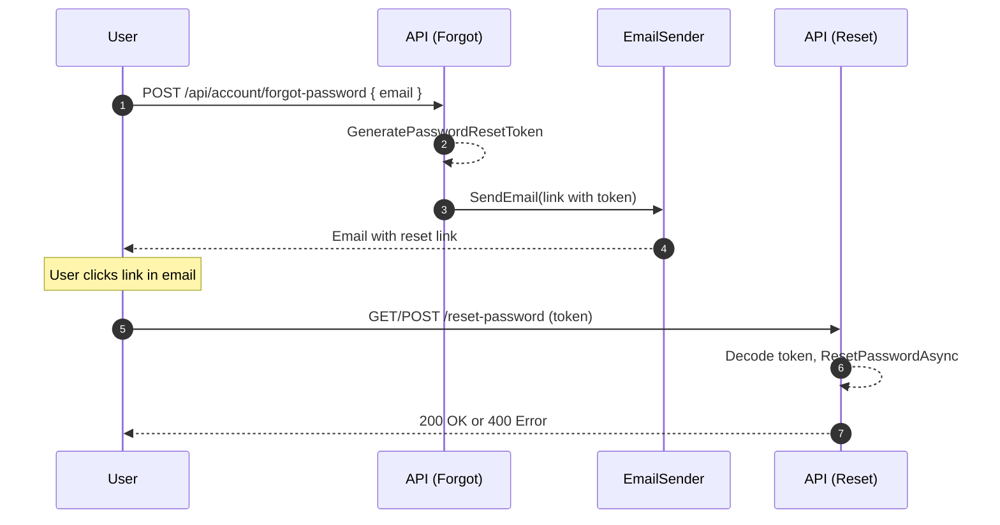
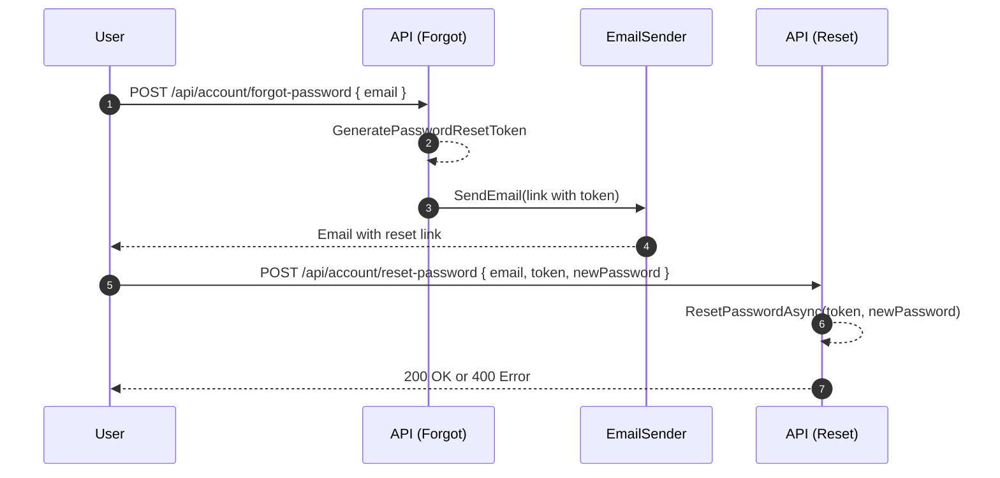
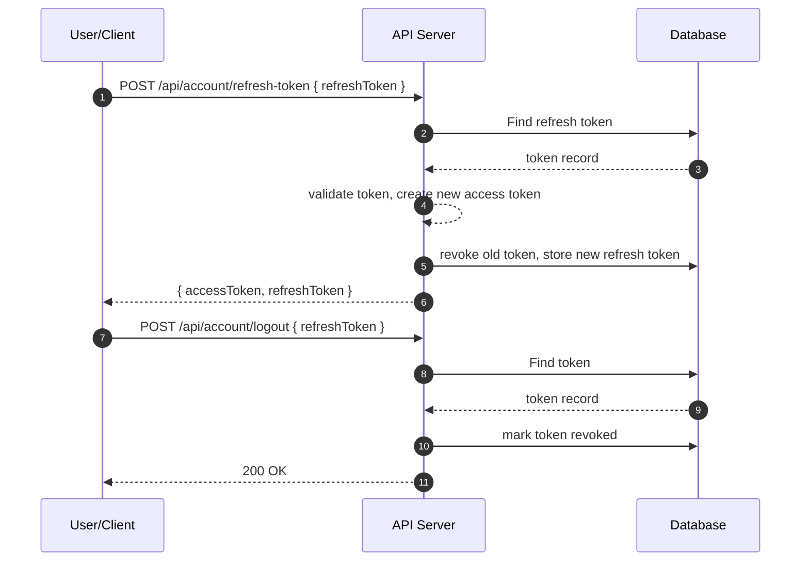
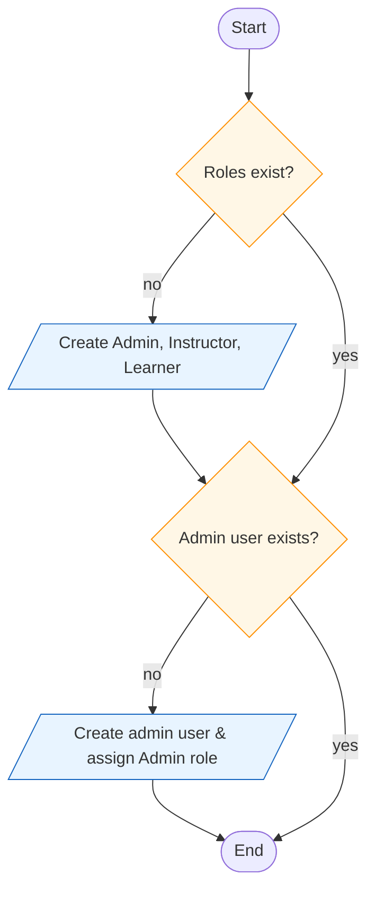
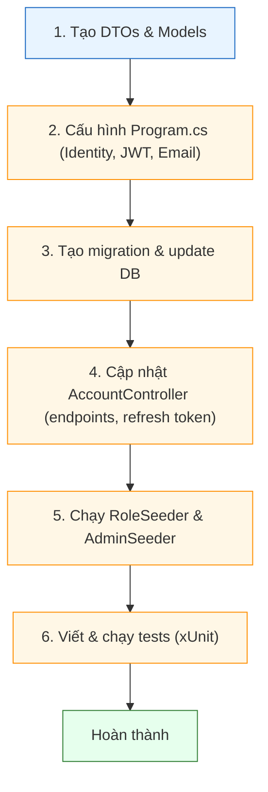

# Hướng dẫn triển khai đầy đủ AccountController & các flow Identity

Mục tiêu: bổ sung đầy đủ các endpoint quản lý tài khoản (change password, forgot/reset password, confirm email, delete account, profile, refresh token/revoke, role management) và hướng dẫn các thay đổi cần thiết trong dự án để chạy được.

Tệp: `LmsMini.Resources/lessons/identity/AccountController_CompleteImplementation.md`

---

## Mục lục

- [1. Tóm tắt các endpoint cần thêm](#1-tóm-tắt-các-endpoint-cần-thêm)
  - [1.1 Bảng tóm tắt endpoint](#11-bảng-tóm-tắt-endpoint)
- [2. DTOs mẫu](#2-dtos-mẫu)
- [3. IEmailSender (service)](#3-iemailsender-service)
  - [3.1 Interface](#31-interface)
  - [3.2 Dev stub (ConsoleEmailSender)](#32-dev-stub-consoleemailsender)
  - [3.3 Production implementations (SMTP / SendGrid)](#33-production-implementations-smtp--sendgrid)
- [4. Program.cs — đăng ký Identity, JWT và DI](#4-programcs-—-đăng-ký-identity-jwt-và-di)
  - [4.1 AddIdentity & TokenProviders](#41-addidentity--tokenproviders)
  - [4.2 JWT configuration (AddAuthentication + AddJwtBearer)](#42-jwt-configuration-addauthentication--addjwtbearer)
  - [4.3 Đăng ký IEmailSender và RoleSeeder](#43-đăng-ký-iemailsender-và-roleseeder)
- [5. Mẫu code (AccountController) — snippets cho từng endpoint](#5-mẫu-code-accountcontroller-—-snippets-cho-từng-endpoint)
  - [5.1 Change password](#51-change-password)
  - [5.2 Forgot password](#52-forgot-password)
  - [5.3 Reset password](#53-reset-password)
  - [5.4 Confirm email](#54-confirm-email)
  - [5.5 Delete account (self)](#55-delete-account-self)
  - [5.6 Get / Update profile](#56-get--update-profile)
  - [5.7 Role endpoints (Admin only)](#57-role-endpoints-admin-only)
  - [5.8 Setup admin (chỉ lần đầu)](#58-setup-admin-chỉ-lần-đầu)
  - [5.9 Login / Register — cập nhật để phát refresh token và gán role](#59-login--register-—-cập-nhật-để-phát-refresh-token-và-gán-role)
  - [5.10 Refresh token & Logout (code mẫu hoàn chỉnh)](#510-refresh-token--logout-code-mẫu-hoàn-chỉnh)
- [6. Email token encoding](#6-email-token-encoding)
- [7. RoleSeeder & AdminSeeder](#7-roleseeder--adminseeder)
- [8. Migration & cập nhật database schema](#8-migration--cập-nhật-database-schema)
- [9. Tests (xUnit) — ví dụ mẫu](#9-tests-xunit-—-ví-dụ-mẫu)
- [10. Security & Best practices](#10-security--best-practices)
- [11. Checklist thực hiện (chi tiết hành động)](#11-checklist-thực-hiện-chi-tiết-hành-động)

---

## 1. Tóm tắt các endpoint cần thêm

Phần này liệt kê các endpoint để triển khai tính năng quản lý tài khoản và role.

### 1.1 Bảng tóm tắt endpoint

| HTTP | URL | Auth | Mô tả | Input DTO | Output |
|---:|---|---|---|---|---|
| POST | /api/account/change-password | Authorized | Đổi mật khẩu | ChangePasswordRequest | 200 Ok / 400 BadRequest |
| POST | /api/account/forgot-password | Public | Gửi email chứa token reset | ForgotPasswordRequest | 200 Ok |
| POST | /api/account/reset-password | Public | Đặt lại mật khẩu bằng token | ResetPasswordRequest | 200 Ok / 400 BadRequest |
| POST | /api/account/confirm-email | Public | Xác nhận email bằng token | ConfirmEmailRequest | 200 Ok / 400 BadRequest |
| DELETE | /api/account | Authorized | Xóa tài khoản của chính user | DeleteAccountRequest? | 200 Ok / 400 BadRequest |
| GET | /api/account/me | Authorized | Lấy profile hiện tại | - | profile JSON |
| PUT | /api/account/me | Authorized | Cập nhật profile | UpdateProfileRequest | 200 Ok / 400 BadRequest |
| POST | /api/account/refresh-token | Public | Đổi refresh token lấy access token mới | RefreshTokenRequest | { accessToken, refreshToken } |
| POST | /api/account/logout | Authorized | Thu hồi refresh token | LogoutRequest | 200 Ok |
| GET | /api/account/roles | Admin only | Lấy danh sách role | - | list roles |
| POST | /api/account/roles | Admin only | Tạo role mới | RoleRequest | 200 Ok / 400 BadRequest |
| PUT | /api/account/roles/{id} | Admin only | Cập nhật role | RoleRequest | 200 Ok / 404 |
| DELETE | /api/account/roles/{id} | Admin only | Xóa role | - | 200 Ok / 404 |
| POST | /api/account/setup-admin | Public (one-time) | Tạo admin mặc định & role | SetupAdminRequest | 200 Ok / 400 |

> *Output* ở trên là mô tả ngắn; trong thực tế có thể trả object lỗi/chi tiết theo chuẩn API của dự án.

**Sơ đồ tổng quan endpoint**

```mermaid
flowchart LR
  classDef public fill:#e6ffed,stroke:#2e7d32,stroke-width:1px;
  classDef auth fill:#e8f4ff,stroke:#1565c0,stroke-width:1px;
  classDef admin fill:#fff0f0,stroke:#c62828,stroke-width:1px;

  subgraph PublicEndpoints[Public]
    FP([/api/account/forgot-password]):::public
    RP([/api/account/reset-password]):::public
    CE([/api/account/confirm-email]):::public
    RT([/api/account/refresh-token]):::public
    SA([/api/account/setup-admin]):::public
  end

  subgraph AuthorizedEndpoints[Authorized]
    CP([/api/account/change-password]):::auth
    ME([/api/account/me (GET)]):::auth
    UME([/api/account/me (PUT)]):::auth
    DEL([/api/account (DELETE)]):::auth
    LO([/api/account/logout]):::auth
  end

  subgraph AdminEndpoints[Admin]
    GR([/api/account/roles (GET)]):::admin
    CR([/api/account/roles (POST)]):::admin
    UR([/api/account/roles/{id} (PUT)]):::admin
    DR([/api/account/roles/{id} (DELETE)]):::admin
  end

  PublicEndpoints --> AuthorizedEndpoints
  AuthorizedEndpoints --> AdminEndpoints
  FP --> RP
  RT --> LO
  SA --> CR
```

---

## 2. DTOs mẫu

> Ghi chú: Một số DTO đã có sẵn trong project (ví dụ RegisterRequest, LoginRequest). Ở danh sách dưới, tôi **đánh dấu**:
>
> - **[EXISTING]** — kiểm tra trong dự án; không tạo lại nếu đã có.
> - **[CREATE]** — tạo mới trong `LmsMini.Api/Models` nếu chưa tồn tại.

```csharp
// [EXISTING] => kiểm tra trong dự án, không tạo nếu đã có
public record RegisterRequest(string Email, string Password); // [EXISTING]
public record LoginRequest(string Email, string Password);    // [EXISTING]

// [CREATE] => tạo mới trong LmsMini.Api/Models nếu chưa có
public record ChangePasswordRequest(string CurrentPassword, string NewPassword); // [CREATE]
public record ForgotPasswordRequest(string Email);                               // [CREATE]
public record ResetPasswordRequest(string Email, string Token, string NewPassword); // [CREATE]
public record ConfirmEmailRequest(Guid UserId, string Token);                    // [CREATE]
public record UpdateProfileRequest(string? UserName, string? DisplayName);       // [CREATE]
public record DeleteAccountRequest(string? Password);                            // [CREATE]
public record RoleRequest(string Name, string Description);                      // [CREATE]
public record SetupAdminRequest(string Email, string Password, string Role);     // [CREATE]

// Refresh token related DTOs
public record RefreshTokenRequest(string RefreshToken);                          // [CREATE]
public record LogoutRequest(string RefreshToken);                                // [CREATE]
```

**Khi nào dùng**:

- [EXISTING] — đã dùng trong controller hiện tại (Register/Login). Không tạo lại.
- [CREATE] — cần cho các flow: đổi mật khẩu, quên/mật khẩu/confirm email, quản lý role, setup admin, cập nhật profile, xóa tài khoản, refresh token/logout.

*Gợi ý:* thêm annotation như `[Required]`, `[EmailAddress]`, `[StringLength]` tuỳ chính sách mật khẩu và validate input.

---

## 3. IEmailSender (service)

Mục đích: gửi email trong các flow *forgot-password* và *confirm-email*.

### 3.1 Interface

Tạo interface trong dự án Infrastructure:

```csharp
public interface IEmailSender
{
    Task SendEmailAsync(string to, string subject, string html);
}
```

### 3.2 Dev stub (ConsoleEmailSender)

Mô tả: implementation đơn giản để phát triển cục bộ — ghi log token / link ra console hoặc Serilog.

```csharp
// LmsMini.Infrastructure/Services/ConsoleEmailSender.cs
public class ConsoleEmailSender : IEmailSender
{
    private readonly ILogger<ConsoleEmailSender> _logger;
    public ConsoleEmailSender(ILogger<ConsoleEmailSender> logger) => _logger = logger;

    public Task SendEmailAsync(string to, string subject, string html)
    {
        _logger.LogInformation("SendEmail to {To} subject {Subject} body: {Html}", to, subject, html);
        return Task.CompletedTask;
    }
}
```

### 3.3 Production implementations (SMTP / SendGrid)

Mô tả: ví dụ triển khai cho SMTP và SendGrid. Lưu cấu hình trong `appsettings.json` hoặc user-secrets.

#### SMTP (System.Net.Mail)

```csharp
public class SmtpEmailSender : IEmailSender
{
    private readonly SmtpOptions _opts;
    public SmtpEmailSender(IOptions<SmtpOptions> opts) => _opts = opts.Value;

    public async Task SendEmailAsync(string to, string subject, string html)
    {
        using var smtp = new SmtpClient(_opts.Host, _opts.Port)
        {
            Credentials = new NetworkCredential(_opts.Username, _opts.Password),
            EnableSsl = _opts.EnableSsl
        };
        var msg = new MailMessage(_opts.From, to, subject, html) { IsBodyHtml = true };
        await smtp.SendMailAsync(msg);
    }
}

public class SmtpOptions { public string Host {get;set;} public int Port {get;set;} public bool EnableSsl {get;set;} public string Username {get;set;} public string Password {get;set;} public string From {get;set;} }
```

Đăng ký DI:

```csharp
builder.Services.Configure<SmtpOptions>(configuration.GetSection("Smtp"));
builder.Services.AddTransient<IEmailSender, SmtpEmailSender>();
```

#### SendGrid (example)

```csharp
public class SendGridEmailSender : IEmailSender
{
    private readonly string _apiKey;
    private readonly string _from;
    public SendGridEmailSender(IConfiguration config)
    {
        _apiKey = config["SendGrid:ApiKey"];
        _from = config["SendGrid:From"];
    }
    public async Task SendEmailAsync(string to, string subject, string html)
    {
        var client = new SendGrid.SendGridClient(_apiKey);
        var msg = new SendGrid.Helpers.Mail.SendGridMessage()
        {
            From = new SendGrid.Helpers.Mail.EmailAddress(_from),
            Subject = subject,
            HtmlContent = html
        };
        msg.AddTo(new SendGrid.Helpers.Mail.EmailAddress(to));
        await client.SendEmailAsync(msg);
    }
}
```

Đăng ký DI:

```csharp
builder.Services.AddTransient<IEmailSender, SendGridEmailSender>();
```

> **Bảo mật:** lưu API keys và credentials trong user-secrets hoặc biến môi trường.

---

## 4. Program.cs — đăng ký Identity, JWT và DI

Trước khi sử dụng các API, cần đăng ký Identity, token providers và authentication.

### 4.1 AddIdentity & TokenProviders

```csharp
builder.Services.AddIdentity<AspNetUser, IdentityRole<Guid>>(options =>
{
    options.User.RequireUniqueEmail = true;
    options.Password.RequiredLength = 8; // production: tăng cường
})
.AddEntityFrameworkStores<LmsDbContext>()
.AddDefaultTokenProviders();
```

### 4.2 JWT configuration (AddAuthentication + AddJwtBearer)

Mô tả: cấu hình JWT để validate token trên request.

**appsettings.json** (mẫu):

```json
"Jwt": {
  "Key": "<YOUR_SECRET_KEY_>_use_user_secrets_or_env",
  "Issuer": "LmsMini",
  "Audience": "LmsMiniClient",
  "ExpiresInMinutes": "60"
}
```

**Program.cs** (mẫu):

```csharp
var key = Encoding.UTF8.GetBytes(configuration["Jwt:Key"] ?? throw new InvalidOperationException("Jwt:Key is missing"));

builder.Services.AddAuthentication(options =>
{
    options.DefaultAuthenticateScheme = JwtBearerDefaults.AuthenticationScheme;
    options.DefaultChallengeScheme = JwtBearerDefaults.AuthenticationScheme;
})
.AddJwtBearer(options =>
{
    options.RequireHttpsMetadata = true;
    options.SaveToken = true;
    options.TokenValidationParameters = new TokenValidationParameters
    {
        ValidateIssuer = true,
        ValidateAudience = true,
        ValidateLifetime = true,
        ValidateIssuerSigningKey = true,
        ValidIssuer = configuration["Jwt:Issuer"],
        ValidAudience = configuration["Jwt:Audience"],
        IssuerSigningKey = new SymmetricSecurityKey(key),
        ClockSkew = TimeSpan.Zero // optional: reduce default 5 minutes
    };

    // Event hooks - optional logging
    options.Events = new JwtBearerEvents
    {
        OnAuthenticationFailed = context =>
        {
            // log
            return Task.CompletedTask;
        }
    };
});

app.UseAuthentication();
app.UseAuthorization();
```

> *Note:* Luôn dùng HTTPS trong production (RequireHttpsMetadata = true).

### 4.3 Đăng ký IEmailSender và RoleSeeder

```csharp
builder.Services.AddTransient<IEmailSender, ConsoleEmailSender>();
// hoặc SmtpEmailSender / SendGridEmailSender
```

Gọi seeder sau `var app = builder.Build();`:

```csharp
await RoleSeeder.SeedAsync(app.Services);
```

---

## 5. Mẫu code (AccountController) — snippets cho từng endpoint

> Mỗi đoạn code kèm mô tả ngắn. Phần này mở rộng code mẫu trước đó và bổ sung refresh token/logout.

### 5.1 Change password

*Đã mô tả ở phần trước.* (giữ nguyên code)

### 5.2 Forgot password

**Mô tả:** Tạo token đặt lại mật khẩu và gửi email (không tiết lộ user tồn tại).

```csharp
[HttpPost("forgot-password")]
public async Task<IActionResult> ForgotPassword(ForgotPasswordRequest req)
{
    var user = await _user_manager.FindByEmailAsync(req.Email);
    if (user == null) return Ok(); // không tiết lộ user tồn tại

    var token = await _user_manager.GeneratePasswordResetTokenAsync(user);
    var encoded = WebEncoders.Base64UrlEncode(Encoding.UTF8.GetBytes(token));
    var url = $"{_config["App:BaseUrl"]}/reset-password?email={Uri.EscapeDataString(user.Email)}&token={encoded}";

    await _emailSender.SendEmailAsync(user.Email, "Reset password", $"Click: {url}");
    return Ok();
}
```

**Sơ đồ Forgot → Reset Password (sequence)**



### 5.3 Reset password

*Đã mô tả ở phần trước.* (giữ nguyên code)

**Sơ đồ Forgot → Reset Password (sequence)** (lặp lại cho chỗ này để độc lập)



### 5.4 Confirm email

*Đã mô tả ở phần trước.* (giữ nguyên code)

### 5.5 Delete account (self)

*Đã mô tả ở phần trước.* (giữ nguyên code)

### 5.6 Get / Update profile

*Đã mô tả ở phần trước.* (giữ nguyên code)

### 5.7 Role endpoints (Admin only)

*Đã mô tả ở phần trước.* (giữ nguyên code)

### 5.8 Setup admin (chỉ lần đầu)

*Đã mô tả ở phần trước.* (giữ nguyên code)

### 5.9 Login / Register — cập nhật để phát refresh token và gán role

*Đã mô tả ở phần trước.* (giữ nguyên code)

### 5.10 Refresh token & Logout (code mẫu hoàn chỉnh)

*Đã mô tả ở phần trước.* (giữ nguyên code)

**Sơ đồ Refresh Token & Logout (sequence)**



---

## 6. Email token encoding

**Mô tả:** Token do Identity sinh có ký tự đặc biệt — *không* truyền thẳng trong URL. Dùng Base64Url encode/decode.

```csharp
var token = await _user_manager.GeneratePasswordResetTokenAsync(user);
var encoded = WebEncoders.Base64UrlEncode(Encoding.UTF8.GetBytes(token));

// Khi nhận lại
var decoded = Encoding.UTF8.GetString(WebEncoders.Base64UrlDecode(encodedToken));
```

> Cần `using Microsoft.AspNetCore.WebUtilities;`.

---

## 7. RoleSeeder & AdminSeeder

**Mô tả:** Seeder tạo các role mặc định (Admin, Instructor, Learner) và (tuỳ) tạo admin user.

**Ví dụ RoleSeeder:** (giữ nguyên đoạn mẫu ở trên)

**Gọi seeder** sau `var app = builder.Build();`:

```csharp
await RoleSeeder.SeedAsync(app.Services);
```

**AdminSeeder (tuỳ chọn)**: tạo user admin mặc định; lưu credentials trong config/user-secrets.

**Sơ đồ Role seeding & Admin tạo**



---

## 8. Migration & cập nhật database schema

### 8.1 Tạo migration

- Cài đặt tools nếu chưa có: `dotnet tool install --global dotnet-ef`.
- Tạo migration cho project Infrastructure (nơi chứa DbContext):

```bash
dotnet ef migrations add InitIdentity -p LmsMini.Infrastructure -s LmsMini.Api
```

Trong lệnh trên: `-p` chỉ định project chứa DbContext; `-s` chỉ định startup project để load configuration.

### 8.2 Áp dụng migration (update DB)

```bash
dotnet ef database update -p LmsMini.Infrastructure -s LmsMini.Api
```

### 8.3 Lưu ý với DB‑first

- Nếu database đã có bảng `AspNetUsers`, xem xét tạo migration baseline rỗng hoặc dùng approach DB‑first.
- Kiểm tra SQL script `dotnet ef migrations script -p ...` trước khi apply lên production.

---

## 9. Tests (xUnit) — ví dụ mẫu

Mô tả: ví dụ test integration cơ bản dùng `WebApplicationFactory<TEntryPoint>`.

### 9.1 Test Register + Login (xUnit)

```csharp
public class AccountControllerTests : IClassFixture<WebApplicationFactory<Program>>
{
    private readonly HttpClient _client;
    public AccountControllerTests(WebApplicationFactory<Program> factory)
    {
        _client = factory.CreateClient();
    }

    [Fact]
    public async Task Register_Then_Login_Returns_Tokens()
    {
        var register = new { Email = "testuser@example.com", Password = "P@ssw0rd!" };
        var rRes = await _client.PostAsJsonAsync("/api/account/register", register);
        rRes.EnsureSuccessStatusCode();

        var login = new { Email = "testuser@example.com", Password = "P@ssw0rd!" };
        var lRes = await _client.PostAsJsonAsync("/api/account/login", login);
        lRes.EnsureSuccessStatusCode();

        var json = await lRes.Content.ReadFromJsonAsync<JsonElement>();
        Assert.True(json.TryGetProperty("token", out _));
    }
}
```

### 9.2 Test ForgotPassword (mock IEmailSender)

- Sử dụng DI overrides in WebApplicationFactory để inject mock `IEmailSender` and assert SendEmailAsync called.

```csharp
// Pseudocode: register mock and verify called
```

> Viết test đầy đủ cần cấu hình test host, in-memory DB hoặc test container DB.

---

## 10. Security & Best practices

Danh sách các điểm bảo mật cần chú ý:

- **Không tiết lộ** user tồn tại trong phản hồi của *forgot-password* (always return 200 Ok).
- **RequireConfirmedEmail**: bật nếu muốn chặn login khi chưa xác thực email.
- **Password policy**: đặt chính sách mật khẩu phù hợp môi trường production (length, complexity).
- **Secrets**: lưu `Jwt:Key`/admin passwords trong user-secrets hoặc biến môi trường — **không** commit vào repo.
- **Token expiry**: access token nên có thời hạn ngắn (ví dụ 1 giờ); dùng refresh token an toàn nếu cần.
- **Re-authentication**: yêu cầu nhập lại mật khẩu cho hành động nhạy cảm (xóa tài khoản, đổi mật khẩu lớn).
- **Logging & Monitoring**: log các sự kiện đăng nhập thất bại, reset token requests, admin role changes.
- **Input validation**: dùng DataAnnotations và server-side validation để tránh injection/XSS.
- **Least privilege**: chỉ cho admin quyền tạo/xoá/ cập nhật role.

---

## 11. Checklist thực hiện (chi tiết hành động)

1. Tạo DTOs [CREATE] trong `LmsMini.Api/Models` nếu chưa có.
2. Tạo `IEmailSender` + `ConsoleEmailSender` trong `LmsMini.Infrastructure/Services`; đăng ký DI.
3. Cập nhật `Program.cs`: AddIdentity, AddDefaultTokenProviders, AddAuthentication (JwtBearer), đăng ký IEmailSender.
4. Thêm `RoleSeeder` (và tuỳ chọn `AdminSeeder`) và gọi sau `builder.Build()`.
5. Mở `LmsMini.Api/Controllers/AccountController.cs`, inject thêm `RoleManager<IdentityRole<Guid>>` và `LmsDbContext` (nếu cần) và thêm endpoint code theo mẫu.
6. Thêm `RefreshToken` entity vào `LmsMini.Infrastructure` và migration.
7. Thêm `using Microsoft.AspNetCore.WebUtilities;` cho Base64Url encode/decode.
8. Chạy `dotnet ef migrations add` và `dotnet ef database update` để cập nhật schema.
9. Chạy `dotnet build` và `dotnet run`; kiểm tra bằng Postman/Swagger.
10. Viết integration tests (mock hoặc test server) cho các flow quan trọng.

**Sơ đồ quy trình triển khai tổng quan**



---

Nếu bạn muốn, tôi có thể:

- **A**: Thực hiện tự động các bước: tạo DTOs [CREATE], tạo `IEmailSender` stub, thêm `RefreshToken` entity + migration skeleton, cập nhật `AccountController` với các endpoint mẫu và chạy build.
- **B**: Chỉ giữ tài liệu (xong) — bạn thực hiện các bước tiếp theo.

Chọn A hoặc B để tôi thực hiện tiếp.
