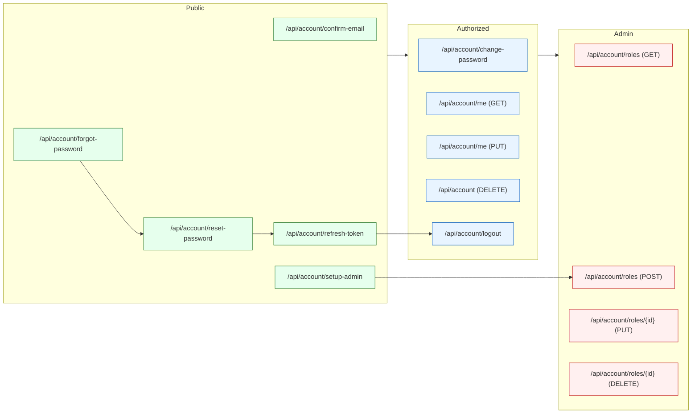
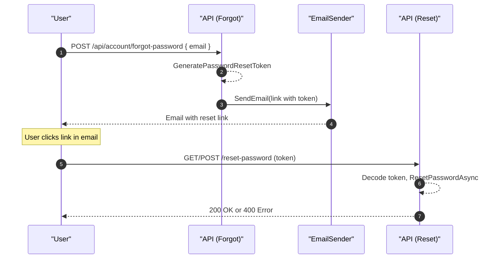
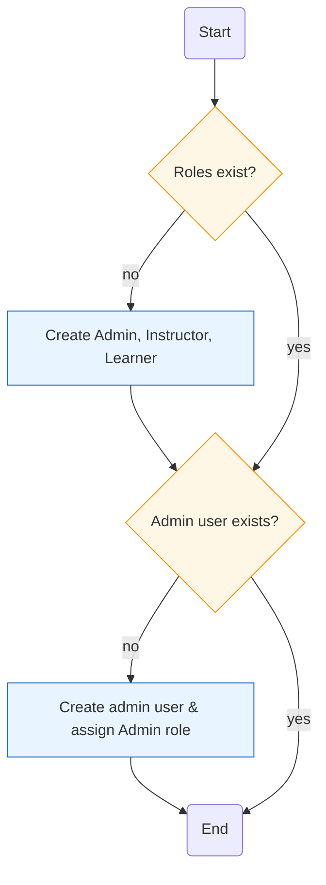

# Hướng dẫn triển khai đầy đủ AccountController & các flow Identity

> **📜 Bản quyền © [2025] [Sok Kim Thanh]**  
> Tài liệu này do [Sok Kim Thanh] biên soạn. Mọi quyền được bảo lưu.  
> Không được sao chép, phân phối hoặc sử dụng cho mục đích thương mại nếu không có sự cho phép bằng văn bản.

Mục tiêu: bổ sung đầy đủ các endpoint quản lý tài khoản (**change password**, **forgot/reset password**, **confirm email**, **delete account**, **profile**, **refresh token/revoke**, **role management**) và hướng dẫn các thay đổi cần thiết trong dự án để chạy được.

Tệp: `LmsMini.Resources/lessons/identity/AccountController_CompleteImplementation.md`

---

## Mục lục

- [1. Tóm tắt các endpoint cần thêm](#1-tóm-tắt-các-endpoint-cần-thêm)
  - [1.1 Bảng tóm tắt endpoint](#11-bảng-tóm-tắt-endpoint)
- [2. DTOs mẫu](#2-dtos-mẫu)
- [3. IEmailSender (service)](#3-iemailsender-service)
  - [3.1 Interface](#31-interface)
  - [3.2 Dev stub (ConsoleEmailSender)](#32-dev-stub-consoleemailsender)
  - [3.3 Production implementations (SMTP / SendGrid)](#33-production-implementations-smtp--sendgrid)
- [4. Program.cs — đăng ký Identity, JWT và DI](#4-programcs-—-đăng-ký-identity-jwt-và-di)
  - [4.1 AddIdentity & TokenProviders](#41-addidentity--tokenproviders)
  - [4.2 JWT configuration (AddAuthentication + AddJwtBearer)](#42-jwt-configuration-addauthentication--addjwtbearer)
  - [4.3 Đăng ký IEmailSender và RoleSeeder](#43-đăng-ký-iemailsender-và-roleseeder)
- [5. Mẫu code (AccountController) — snippets cho từng endpoint](#5-mẫu-code-accountcontroller-—-snippets-cho-từng-endpoint)
  - [5.1 Change password](#51-change-password)
  - [5.2 Forgot password](#52-forgot-password)
  - [5.3 Reset password](#53-reset-password)
  - [5.4 Confirm email](#54-confirm-email)
  - [5.5 Delete account (self)](#55-delete-account-self)
  - [5.6 Get / Update profile](#56-get--update-profile)
  - [5.7 Role endpoints (Admin only)](#57-role-endpoints-admin-only)
  - [5.8 Setup admin (chỉ lần đầu)](#58-setup-admin-chỉ-lần-đầu)
  - [5.9 Login / Register — cập nhật để phát refresh token và gán role](#59-login--register-—-cập-nhật-để-phát-refresh-token-và-gán-role)
  - [5.10 Refresh token & Logout (code mẫu hoàn chỉnh)](#510-refresh-token--logout-code-mẫu-hoàn-chỉnh)
- [6. Email token encoding](#6-email-token-encoding)
- [7. RoleSeeder & AdminSeeder](#7-roleseeder--adminseeder)
- [8. Migration & cập nhật database schema](#8-migration--cập-nhật-database-schema)
- [9. Tests (xUnit) — ví dụ mẫu](#9-tests-xunit-—-ví-dụ-mẫu)
- [10. Security & Best practices](#10-security--best-practices)
- [11. Checklist thực hiện (chi tiết hành động)](#11-checklist-thực-hiện-chi-tiết-hành-động)

---

## 1. Tóm tắt các endpoint cần thêm

Tóm tắt: phần này liệt kê tất cả **endpoint** liên quan tới quản lý tài khoản và role. Dùng để nhanh nắm chức năng có sẵn và quyền truy cập yêu cầu.

- **Key points**:
  - Bao gồm flow: **forgot/reset**, **confirm email**, **change password**, **profile**, **refresh token**, **logout**, **role CRUD**, **setup-admin**.
  - Phân loại theo quyền: **Public**, **Authorized**, **Admin only**.

### 1.1 Bảng tóm tắt endpoint

| HTTP | URL | Auth | Mô tả | Input DTO | Output |
|---:|---|---|---|---|---|
| POST | /api/account/change-password | **Authorized** | Đổi mật khẩu | **ChangePasswordRequest** | 200 Ok / 400 BadRequest |
| POST | /api/account/forgot-password | **Public** | Gửi email chứa token reset | **ForgotPasswordRequest** | 200 Ok |
| POST | /api/account/reset-password | **Public** | Đặt lại mật khẩu bằng token | **ResetPasswordRequest** | 200 Ok / 400 BadRequest |
| POST | /api/account/confirm-email | **Public** | Xác nhận email bằng token | **ConfirmEmailRequest** | 200 Ok / 400 BadRequest |
| DELETE | /api/account | **Authorized** | Xóa tài khoản của chính user | **DeleteAccountRequest?** | 200 Ok / 400 BadRequest |
| GET | /api/account/me | **Authorized** | Lấy profile hiện tại | - | profile JSON |
| PUT | /api/account/me | **Authorized** | Cập nhật profile | **UpdateProfileRequest** | 200 Ok / 400 BadRequest |
| POST | /api/account/refresh-token | **Public** | Đổi refresh token lấy access token mới | **RefreshTokenRequest** | { accessToken, refreshToken } |
| POST | /api/account/logout | **Authorized** | Thu hồi refresh token | **LogoutRequest** | 200 Ok |
| GET | /api/account/roles | **Admin only** | Lấy danh sách role | - | list roles |
| POST | /api/account/roles | **Admin only** | Tạo role mới | **RoleRequest** | 200 Ok / 400 BadRequest |
| PUT | /api/account/roles/{id} | **Admin only** | Cập nhật role | **RoleRequest** | 200 Ok / 404 |
| DELETE | /api/account/roles/{id} | **Admin only** | Xóa role | - | 200 Ok / 404 |
| POST | /api/account/setup-admin | **Public (one-time)** | Tạo admin mặc định & role | **SetupAdminRequest** | 200 Ok / 400 |

> 💡 Tip: tìm nhanh theo **URL** hoặc **DTO** khi cần kiểm tra input/output.

**Sơ đồ tổng quan endpoint**

Sơ đồ này minh họa toàn bộ các endpoint của AccountController, phân loại theo quyền truy cập.



---

## 2. DTOs mẫu

Tóm tắt: liệt kê **DTO** cần dùng; phân nhóm **[EXISTING]** (kiểm tra, không tạo) và **[CREATE]** (tạo mới nếu chưa có).

- **Key DTOs**: **RegisterRequest**, **LoginRequest**, **ChangePasswordRequest**, **ForgotPasswordRequest**, **ResetPasswordRequest**, **ConfirmEmailRequest**, **UpdateProfileRequest**, **DeleteAccountRequest**, **RoleRequest**, **SetupAdminRequest**, **RefreshTokenRequest**, **LogoutRequest**.

```csharp
// [EXISTING] => kiểm tra trong dự án, không tạo nếu đã có
public record RegisterRequest(string Email, string Password); // [EXISTING]
public record LoginRequest(string Email, string Password);    // [EXISTING]

// [CREATE] => tạo mới trong LmsMini.Api/Models nếu chưa có
public record ChangePasswordRequest(string CurrentPassword, string NewPassword); // [CREATE]
public record ForgotPasswordRequest(string Email);                               // [CREATE]
public record ResetPasswordRequest(string Email, string Token, string NewPassword); // [CREATE]
public record ConfirmEmailRequest(Guid UserId, string Token);                    // [CREATE]
public record UpdateProfileRequest(string? UserName, string? DisplayName);       // [CREATE]
public record DeleteAccountRequest(string? Password);                            // [CREATE]
public record RoleRequest(string Name, string Description);                      // [CREATE]
public record SetupAdminRequest(string Email, string Password, string Role);     // [CREATE]

// Refresh token related DTOs
public record RefreshTokenRequest(string RefreshToken);                          // [CREATE]
public record LogoutRequest(string RefreshToken);                                // [CREATE]
```

> ⚠️ Kiểm tra xem **RegisterRequest** và **LoginRequest** đã tồn tại trong project trước khi tạo file mới.

---

## 3. IEmailSender (service)

Tóm tắt: interface để *gửi email* trong các flow **forgot-password** và **confirm-email**. Có 2 hạng mục: *dev stub* và *production implementation*.

- **Quick**:
  - Tạo **IEmailSender** trong Infrastructure.
  - Dùng **ConsoleEmailSender** cho dev; dùng **SmtpEmailSender** hoặc **SendGridEmailSender** cho production.

> ⚠️ Code mẫu chỉ dùng cho mục đích học tập và tham khảo.  
> Không triển khai trực tiếp vào môi trường production nếu chưa rà soát bảo mật.

### 3.1 Interface

```csharp
// Purpose: Interface cho dịch vụ gửi email (gọi từ controller/service)
public interface IEmailSender
{
    Task SendEmailAsync(string to, string subject, string html);
}
```

### 3.2 Dev stub (ConsoleEmailSender)

> ⚠️ Code mẫu chỉ dùng cho mục đích học tập và tham khảo.  
> Không triển khai trực tiếp vào môi trường production nếu chưa rà soát bảo mật.

```csharp
// Purpose: Dev/stub implementation - log email vào console hoặc ILogger
// LmsMini.Infrastructure/Services/ConsoleEmailSender.cs
public class ConsoleEmailSender : IEmailSender
{
    private readonly ILogger<ConsoleEmailSender> _logger;
    public ConsoleEmailSender(ILogger<ConsoleEmailSender> logger) => _logger = logger;

    public Task SendEmailAsync(string to, string subject, string html)
    {
        _logger.LogInformation("SendEmail to {To} subject {Subject} body: {Html}", to, subject, html);
        return Task.CompletedTask;
    }
}
```

### 3.3 Production implementations (SMTP / SendGrid)

> ⚠️ Code mẫu chỉ dùng cho mục đích học tập và tham khảo.  
> Không triển khai trực tiếp vào môi trường production nếu chưa rà soát bảo mật.

```csharp
// Purpose: SMTP implementation dùng System.Net.Mail
public class SmtpEmailSender : IEmailSender
{
    private readonly SmtpOptions _opts;
    public SmtpEmailSender(IOptions<SmtpOptions> opts) => _opts = opts.Value;

    public async Task SendEmailAsync(string to, string subject, string html)
    {
        using var smtp = new SmtpClient(_opts.Host, _opts.Port)
        {
            Credentials = new NetworkCredential(_opts.Username, _opts.Password),
            EnableSsl = _opts.EnableSsl
        };
        var msg = new MailMessage(_opts.From, to, subject, html) { IsBodyHtml = true };
        await smtp.SendMailAsync(msg);
    }
}

public class SmtpOptions { public string Host {get;set;} public int Port {get;set;} public bool EnableSsl {get;set;} public string Username {get;set;} public string Password {get;set;} public string From {get;set;} }
```

```csharp
// Purpose: SendGrid implementation example
public class SendGridEmailSender : IEmailSender
{
    private readonly string _apiKey;
    private readonly string _from;
    public SendGridEmailSender(IConfiguration config)
    {
        _apiKey = config["SendGrid:ApiKey"];
        _from = config["SendGrid:From"];
    }
    public async Task SendEmailAsync(string to, string subject, string html)
    {
        var client = new SendGrid.SendGridClient(_apiKey);
        var msg = new SendGrid.Helpers.Mail.SendGridMessage()
        {
            From = new SendGrid.Helpers.Mail.EmailAddress(_from),
            Subject = subject,
            HtmlContent = html
        };
        msg.AddTo(new SendGrid.Helpers.Mail.EmailAddress(to));
        await client.SendEmailAsync(msg);
    }
}
```

> ⚠️ Bảo mật: lưu **API keys** và credentials trong **user-secrets** hoặc biến môi trường; không commit vào repo.

---

## 4. Program.cs — đăng ký Identity, JWT và DI

Tóm tắt: cấu hình **Identity**, **JWT authentication** và đăng ký DI cho **IEmailSender**. Đây là bước cần làm trước khi dùng các endpoint.

- **Quick**: AddIdentity, AddDefaultTokenProviders, AddAuthentication(JwtBearer), Register IEmailSender, seed roles.

> ⚠️ Code mẫu chỉ dùng cho mục đích học tập và tham khảo.  
> Không triển khai trực tiếp vào môi trường production nếu chưa rà soát bảo mật.

### 4.1 AddIdentity & TokenProviders

```csharp
// Purpose: Đăng ký Identity với EF stores và Default Token Providers
builder.Services.AddIdentity<AspNetUser, IdentityRole<Guid>>(options =>
{
    options.User.RequireUniqueEmail = true;
    options.Password.RequiredLength = 8; // production: tăng cường
})
.AddEntityFrameworkStores<LmsDbContext>()
.AddDefaultTokenProviders();
```

### 4.2 JWT configuration (AddAuthentication + AddJwtBearer)

```json
// Purpose: cấu hình JWT trong appsettings.json
"Jwt": {
  "Key": "<YOUR_SECRET_KEY_>_use_user_secrets_or_env",
  "Issuer": "LmsMini",
  "Audience": "LmsMiniClient",
  "ExpiresInMinutes": "60"
}
```

```csharp
// Purpose: Đăng ký JWT Bearer và TokenValidation
var key = Encoding.UTF8.GetBytes(configuration["Jwt:Key"] ?? throw new InvalidOperationException("Jwt:Key is missing"));

builder.Services.AddAuthentication(options =>
{
    options.DefaultAuthenticateScheme = JwtBearerDefaults.AuthenticationScheme;
    options.DefaultChallengeScheme = JwtBearerDefaults.AuthenticationScheme;
})
.AddJwtBearer(options =>
{
    options.RequireHttpsMetadata = true;
    options.SaveToken = true;
    options.TokenValidationParameters = new TokenValidationParameters
    {
        ValidateIssuer = true,
        ValidateAudience = true,
        ValidateLifetime = true,
        ValidateIssuerSigningKey = true,
        ValidIssuer = configuration["Jwt:Issuer"],
        ValidAudience = configuration["Jwt:Audience"],
        IssuerSigningKey = new SymmetricSecurityKey(key),
        ClockSkew = TimeSpan.Zero // optional: reduce default 5 minutes
    };

    // Event hooks - optional logging
    options.Events = new JwtBearerEvents
    {
        OnAuthenticationFailed = context =>
        {
            // log
            return Task.CompletedTask;
        }
    };
});

app.UseAuthentication();
app.UseAuthorization();
```

> ⚠️ Lưu ý: luôn lưu **Jwt:Key** ở nơi an toàn (user-secrets hoặc biến môi trường). Sử dụng HTTPS trong production.

### 4.3 Đăng ký IEmailSender và RoleSeeder

```csharp
// Purpose: Đăng ký dịch vụ gửi email (dev/prod) và gọi seeder cho roles
builder.Services.AddTransient<IEmailSender, ConsoleEmailSender>();
// hoặc SmtpEmailSender / SendGridEmailSender

// Gọi seeder sau builder.Build()
await RoleSeeder.SeedAsync(app.Services);
```

---

## 5. Mẫu code (AccountController) — snippets cho từng endpoint

Tóm tắt: chứa các **code mẫu** cho từng endpoint; mỗi đoạn có mục đích rõ ràng và có thể copy-paste vào controller. Các code dài đã được chia thành các phần nhỏ.

- **Quick index**:
  - 5.1 Change password
  - 5.2 Forgot password
  - 5.3 Reset password
  - 5.4 Confirm email
  - 5.5 Delete account
  - 5.6 Get / Update profile
  - 5.7 Role CRUD (Admin only)
  - 5.8 Setup admin
  - 5.9 Register / Login (with refresh token)
  - 5.10 Refresh token & Logout

> ⚠️ Code mẫu chỉ dùng cho mục đích học tập và tham khảo.  
> Không triển khai trực tiếp vào môi trường production nếu chưa rà soát bảo mật.

### 5.1 Change password

**Code mẫu: Change Password**

Mẫu endpoint đổi mật khẩu cho user đã đăng nhập, sử dụng **UserManager.ChangePasswordAsync**.

```csharp
// Purpose: Change current user's password
[HttpPost("change-password")]
[Authorize]
public async Task<IActionResult> ChangePassword(ChangePasswordRequest req)
{
    var user = await _userManager.GetUserAsync(User);
    if (user == null) return Unauthorized();

    var res = await _user_manager.ChangePasswordAsync(user, req.CurrentPassword, req.NewPassword);
    if (!res.Succeeded)
    {
        return BadRequest(res.Errors);
    }

    return Ok();
}
```

### 5.2 Forgot password

**Mô tả:** Tạo token đặt lại mật khẩu và gửi email (không tiết lộ user tồn tại).

```csharp
// Purpose: Generate password reset token and email the link to user
[HttpPost("forgot-password")]
public async Task<IActionResult> ForgotPassword(ForgotPasswordRequest req)
{
    var user = await _user_manager.FindByEmailAsync(req.Email);
    if (user == null) return Ok(); // không tiết lộ user tồn tại

    var token = await _user_manager.GeneratePasswordResetTokenAsync(user);
    var encoded = WebEncoders.Base64UrlEncode(Encoding.UTF8.GetBytes(token));
    var url = $"{_config["App:BaseUrl"]}/reset-password?email={Uri.EscapeDataString(user.Email)}&token={encoded}";

    await _emailSender.SendEmailAsync(user.Email, "Reset password", $"Click: {url}");
    return Ok();
}
```

**Luồng Forgot/Reset Password**

Minh họa các bước từ khi người dùng yêu cầu quên mật khẩu đến khi đặt lại mật khẩu thành công.



(This is a large file; license will be appended at end.)

### 5.3 Reset password

**Code mẫu: Reset Password**


Mẫu endpoint nhận token (Base64Url), decode và gọi **ResetPasswordAsync**.


```csharp
// Purpose: Reset user's password using token sent by email
[HttpPost("reset-password")]
public async Task<IActionResult> ResetPassword(ResetPasswordRequest req)
{
    var user = await _user_manager.FindByEmailAsync(req.Email);
    if (user == null) return BadRequest("Invalid request");

    var token = Encoding.UTF8.GetString(WebEncoders.Base64UrlDecode(req.Token));
    var res = await _user_manager.ResetPasswordAsync(user, token, req.NewPassword);
    if (!res.Succeeded)
    {
        return BadRequest(res.Errors);
    }

    return Ok();
}
```

### 5.4 Confirm email

**Code mẫu: Confirm Email**


Endpoint xác nhận email bằng token do Identity sinh ra.


```csharp
// Purpose: Confirm user's email using token
[HttpPost("confirm-email")]
public async Task<IActionResult> ConfirmEmail(ConfirmEmailRequest req)
{
    var user = await _user_manager.FindByIdAsync(req.UserId.ToString());
    if (user == null) return BadRequest();

    var res = await _user_manager.ConfirmEmailAsync(user, req.Token);
    if (!res.Succeeded)
    {
        return BadRequest(res.Errors);
    }

    return Ok();
}
```

### 5.5 Delete account (self)

**Code mẫu: Delete Account**


Endpoint cho phép user tự xóa tài khoản; có thể yêu cầu nhập lại mật khẩu.


```csharp
// Purpose: Allow authenticated user to delete own account
[HttpDelete]
[Authorize]
public async Task<IActionResult> DeleteAccount(DeleteAccountRequest? req = null)
{
    var user = await _user_manager.GetUserAsync(User);
    if (user == null) return Unauthorized();

    if (req?.Password != null)
    {
        var check = await _user_manager.CheckPasswordAsync(user, req.Password);
        if (!check) return BadRequest("Invalid password");
    }

    var res = await _user_manager.DeleteAsync(user);
    if (!res.Succeeded)
    {
        return BadRequest(res.Errors);
    }

    return Ok();
}
```

### 5.6 Get / Update profile

**Code mẫu: Get / Update Profile**


Endpoints lấy và cập nhật thông tin profile của user hiện tại.


```csharp
// Purpose: Return current user's profile
[HttpGet("me")]
[Authorize]
public async Task<IActionResult> Me()
{
    var user = await _user_manager.GetUserAsync(User);
    if (user == null) return Unauthorized();
    var roles = await _user_manager.GetRolesAsync(user);
    return Ok(new { user.Id, user.Email, user.UserName, Roles = roles });
}

// Purpose: Update current user's profile fields
[HttpPut("me")]
[Authorize]
public async Task<IActionResult> UpdateProfile(UpdateProfileRequest req)
{
    var user = await _user_manager.GetUserAsync(User);
    if (user == null) return Unauthorized();

    if (!string.IsNullOrWhiteSpace(req.UserName)) user.UserName = req.UserName;
    // cập nhật các trường khác nếu có

    var res = await _user_manager.UpdateAsync(user);
    if (!res.Succeeded)
    {
        return BadRequest(res.Errors);
    }

    return Ok();
}
```

### 5.7 Role endpoints (Admin only)

**Code mẫu: Role CRUD (Admin only)**


Endpoints quản lý role, bảo vệ bằng role **Admin**.


```csharp
// Purpose: Get all roles (Admin only)
[HttpGet("roles")]
[Authorize(Roles = "Admin")]
public async Task<IActionResult> GetRoles()
{
    var roles = await _role_manager.Roles.ToListAsync();
    return Ok(roles);
}

// Purpose: Create new role (Admin only)
[HttpPost("roles")]
[Authorize(Roles = "Admin")]
public async Task<IActionResult> CreateRole(RoleRequest req)
{
    var role = new IdentityRole<Guid> { Name = req.Name, NormalizedName = req.Name.ToUpper() };
    var res = await _role_manager.CreateAsync(role);
    if (!res.Succeeded) return BadRequest(res.Errors);
    return Ok();
}

// Purpose: Update role by id (Admin only)
[HttpPut("roles/{id}")]
[Authorize(Roles = "Admin")]
public async Task<IActionResult> UpdateRole(Guid id, RoleRequest req)
{
    var role = await _role_manager.FindByIdAsync(id.ToString());
    if (role == null) return NotFound();

    role.Name = req.Name;
    role.NormalizedName = req.Name.ToUpper();
    var res = await _role_manager.UpdateAsync(role);
    if (!res.Succeeded) return BadRequest(res.Errors);
    return Ok();
}

// Purpose: Delete role by id (Admin only)
[HttpDelete("roles/{id}")]
[Authorize(Roles = "Admin")]
public async Task<IActionResult> DeleteRole(Guid id)
{
    var role = await _role_manager.FindByIdAsync(id.ToString());
    if (role == null) return NotFound();

    var res = await _role_manager.DeleteAsync(role);
    if (!res.Succeeded) return BadRequest(res.Errors);
    return Ok();
}
```

### 5.8 Setup admin (chỉ lần đầu)

**Code mẫu: Setup Admin**


```csharp
// Purpose: Create Admin role and an admin user on initial setup
[HttpPost("setup-admin")]
public async Task<IActionResult> SetupAdmin(SetupAdminRequest req)
{
    var adminRole = new IdentityRole<Guid> { Name = "Admin", NormalizedName = "ADMIN" };
    await _role_manager.CreateAsync(adminRole);

    var user = new AspNetUser { UserName = req.Email, Email = req.Email };
    var res = await _user_manager.CreateAsync(user, req.Password);
    if (res.Succeeded)
    {
        await _user_manager.AddToRoleAsync(user, adminRole.Name);
        return Ok();
    }
    return BadRequest(res.Errors);
}
```

### 5.9 Login / Register — cập nhật để phát refresh token và gán role

**Code mẫu: Register (thêm gán role)**

```csharp
// Purpose: Register new user and assign default role
[HttpPost("register")]
public async Task<IActionResult> Register(RegisterRequest req)
{
    var user = new AspNetUser
    {
        UserName = req.Email,
        Email = req.Email
    };
    var result = await _user_manager.CreateAsync(user, req.Password);
    if (!result.Succeeded)
    {
        return BadRequest(result.Errors);
    }

    // Gán role mặc định
    await _user_manager.AddToRoleAsync(user, "Learner");

    return Ok();
}
```

**Code mẫu: Login (trả access token + refresh token)**

```csharp
// Purpose: Authenticate user, issue JWT access token and refresh token
[HttpPost("login")]
public async Task<IActionResult> Login(LoginRequest req)
{
    var user = await _user_manager.FindByEmailAsync(req.Email);
    if (user == null) return Unauthorized();

    var pwOk = await _user_manager.CheckPasswordAsync(user, req.Password);
    if (!pwOk) return Unauthorized();

    var roles = await _user_manager.GetRolesAsync(user);
    var claims = new List<Claim>
    {
        new Claim(JwtRegisteredClaimNames.Sub, user.Id.ToString()),
        new Claim(JwtRegisteredClaimNames.Email, user.Email ?? string.Empty),
        new Claim(ClaimTypes.Name, user.UserName ?? string.Empty)
    };
    claims.AddRange(roles.Select(r => new Claim(ClaimTypes.Role, r)));

    var jwtKey = _config["Jwt:Key"];
    if (string.IsNullOrWhiteSpace(jwtKey)) return StatusCode(500, "JWT key is not configured.");

    var key = new SymmetricSecurityKey(Encoding.UTF8.GetBytes(jwtKey));
    var creds = new SigningCredentials(key, SecurityAlgorithms.HmacSha256);

    var issuer = _config["Jwt:Issuer"];
    var audience = _config["Jwt:Audience"];
    var expiresInMinutes = 60;
    if (int.TryParse(_config["Jwt:ExpiresInMinutes"], out var minutes)) expiresInMinutes = minutes;

    var tokenDescriptor = new JwtSecurityToken(
        issuer: issuer,
        audience: audience,
        claims: claims,
        expires: DateTime.UtcNow.AddMinutes(expiresInMinutes),
        signingCredentials: creds
    );

    var accessToken = new JwtSecurityTokenHandler().WriteToken(tokenDescriptor);

    // tạo refresh token và lưu vào DB
    var refreshToken = Convert.ToBase64String(RandomNumberGenerator.GetBytes(64));
    var rt = new RefreshToken { Token = refreshToken, UserId = user.Id, Expires = DateTime.UtcNow.AddDays(7) };
    _db.RefreshTokens.Add(rt);
    await _db.SaveChangesAsync();

    return Ok(new { accessToken, refreshToken });
}
```

> 💡 Ghi chú: **_db_** là instance của **LmsDbContext** có `DbSet<RefreshToken> RefreshTokens`.


### 5.10 Refresh token & Logout (code mẫu hoàn chỉnh)

**Code mẫu: Refresh Token & Logout**


```csharp
// Purpose: Exchange refresh token for new access token; revoke old token
[HttpPost("refresh-token")]
public async Task<IActionResult> RefreshToken(RefreshTokenRequest req)
{
    var stored = await _db.RefreshTokens.SingleOrDefaultAsync(r => r.Token == req.RefreshToken);
    if (stored == null || stored.IsRevoked || stored.Expires < DateTime.UtcNow) return Unauthorized();

    var user = await _user_manager.FindByIdAsync(stored.UserId.ToString());
    if (user == null) return Unauthorized();

    var roles = await _user_manager.GetRolesAsync(user);
    var claims = new List<Claim>
    {
        new Claim(JwtRegisteredClaimNames.Sub, user.Id.ToString()),
        new Claim(JwtRegisteredClaimNames.Email, user.Email ?? string.Empty),
        new Claim(ClaimTypes.Name, user.UserName ?? string.Empty)
    };
    claims.AddRange(roles.Select(r => new Claim(ClaimTypes.Role, r)));

    var key = new SymmetricSecurityKey(Encoding.UTF8.GetBytes(_config["Jwt:Key"]!));
    var creds = new SigningCredentials(key, SecurityAlgorithms.HmacSha256);
    var token = new JwtSecurityToken(
        issuer: _config["Jwt:Issuer"],
        audience: _config["Jwt:Audience"],
        claims: claims,
        expires: DateTime.UtcNow.AddMinutes(int.Parse(_config["Jwt:ExpiresInMinutes"] ?? "60")),
        signingCredentials: creds
    );
    var accessToken = new JwtSecurityTokenHandler().WriteToken(token);

    stored.IsRevoked = true;
    var newRt = Convert.ToBase64String(RandomNumberGenerator.GetBytes(64));
    var rtEntity = new RefreshToken { Token = newRt, UserId = stored.UserId, Expires = DateTime.UtcNow.AddDays(7) };
    _db.RefreshTokens.Add(rtEntity);
    await _db.SaveChangesAsync();

    return Ok(new { accessToken, refreshToken = newRt });
}

// Purpose: Revoke refresh token on logout
[HttpPost("logout")]
[Authorize]
public async Task<IActionResult> Logout(LogoutRequest req)
{
    var stored = await _db.RefreshTokens.SingleOrDefaultAsync(r => r.Token == req.RefreshToken);
    if (stored != null)
    {
        stored.IsRevoked = true;
        await _db.SaveChangesAsync();
    }
    return Ok();
}
```

---

## 6. Email token encoding

Tóm tắt: token do Identity sinh có ký tự đặc biệt, **không** truyền trực tiếp trong URL. Dùng **Base64Url** encode/decode.

```csharp
// Purpose: Encode Identity tokens to be URL-safe
var token = await _user_manager.GeneratePasswordResetTokenAsync(user);
var encoded = WebEncoders.Base64UrlEncode(Encoding.UTF8.GetBytes(token));

// Khi nhận lại
var decoded = Encoding.UTF8.GetString(WebEncoders.Base64UrlDecode(encodedToken));
```

> 💡 Lưu ý: thêm `using Microsoft.AspNetCore.WebUtilities;` khi dùng `WebEncoders`.

---

## 7. RoleSeeder & AdminSeeder

Tóm tắt: Seeder tạo các role mặc định và (tuỳ) tạo admin mặc định.

- **Quick**: seed roles: **Admin**, **Instructor**, **Learner**; tạo admin user nếu cần.

```csharp
// Purpose: Example RoleSeeder
public static class RoleSeeder
{
    public static async Task SeedAsync(IServiceProvider services)
    {
        using var scope = services.CreateScope();
        var rm = scope.ServiceProvider.GetRequiredService<RoleManager<IdentityRole<Guid>>>();
        var roles = new[] { "Admin", "Instructor", "Learner" };
        foreach (var r in roles)
        {
            if (!await rm.RoleExistsAsync(r)) await rm.CreateAsync(new IdentityRole<Guid>(r));
        }
    }
}
```

**Quy trình seed role và admin**



---

## 8. Migration & cập nhật database schema

Tóm tắt: hướng dẫn tạo migration và áp dụng lên DB. Dùng **dotnet-ef** tool.

- Tạo migration, áp dụng `dotnet ef migrations add` và `dotnet ef database update`.

```bash
// Purpose: Create migration in Infrastructure project and apply to DB
dotnet ef migrations add InitIdentity -p LmsMini.Infrastructure -s LmsMini.Api

dotnet ef database update -p LmsMini.Infrastructure -s LmsMini.Api
```

> ⚠️ Trước khi apply lên production, kiểm tra script SQL bằng `dotnet ef migrations script`.

---

## 9. Tests (xUnit) — ví dụ mẫu

Tóm tắt: ví dụ test integration sử dụng **WebApplicationFactory<Program>**. Gợi ý mock **IEmailSender** và dùng in-memory DB.

```csharp
// Purpose: Integration test for register + login
public class AccountControllerTests : IClassFixture<WebApplicationFactory<Program>>
{
    private readonly HttpClient _client;
    public AccountControllerTests(WebApplicationFactory<Program> factory)
    {
        _client = factory.CreateClient();
    }

    [Fact]
    public async Task Register_Then_Login_Returns_Tokens()
    {
        var register = new { Email = "testuser@example.com", Password = "P@ssw0rd!" };
        var rRes = await _client.PostAsJsonAsync("/api/account/register", register);
        rRes.EnsureSuccessStatusCode();

        var login = new { Email = "testuser@example.com", Password = "P@ssw0rd!" };
        var lRes = await _client.PostAsJsonAsync("/api/account/login", login);
        lRes.EnsureSuccessStatusCode();

        var json = await lRes.Content.ReadFromJsonAsync<JsonElement>();
        Assert.True(json.TryGetProperty("token", out _));
    }
}
```

### 9.2 Test ForgotPassword (mock IEmailSender)

- Sử dụng DI overrides in WebApplicationFactory để inject mock `IEmailSender` and assert SendEmailAsync called.

```csharp
// Purpose: Test ForgotPassword with mocked IEmailSender
public class AccountControllerTests : IClassFixture<WebApplicationFactory<Program>>
{
    private readonly HttpClient _client;
    private readonly Mock<IEmailSender> _emailSenderMock = new();

    public AccountControllerTests(WebApplicationFactory<Program> factory)
    {
        _client = factory
            .WithWebHostBuilder(builder =>
            {
                builder.ConfigureServices(services =>
                {
                    // Remove existing IEmailSender registration
                    var descriptor = services.SingleOrDefault(
                        d => d.ServiceType == typeof(IEmailSender));
                    if (descriptor != null)
                    {
                        services.Remove(descriptor);
                    }

                    // Add our mock IEmailSender
                    services.AddSingleton<IEmailSender>(_emailSenderMock.Object);
                });
            })
            .CreateClient();
    }

    [Fact]
    public async Task ForgotPassword_SendsEmail()
    {
        // Arrange
        var email = "testuser@example.com";
        var request = new ForgotPasswordRequest { Email = email };

        // Act
        await _client.PostAsJsonAsync("/api/account/forgot-password", request);

        // Assert
        _emailSenderMock.Verify(es => es.SendEmailAsync(
            email, It.IsAny<string>(), It.IsAny<string>()), Times.Once);
    }
}
```

> Viết test đầy đủ cần cấu hình test host, in-memory DB hoặc test container DB.

---

## 10. Security & Best practices

Tóm tắt: các điểm bảo mật cần quan tâm khi triển khai Identity.

- **Không tiết lộ** user tồn tại trong phản hồi của *forgot-password*.
- **RequireConfirmedEmail**: bật nếu muốn chặn login khi chưa xác thực email.
- **Password policy**: đặt chính sách mật khẩu (độ dài, complexity).
- **Secrets**: dùng user-secrets hoặc biến môi trường cho keys.
- **Token expiry**: access token nên ngắn (ví dụ 1 giờ); dùng refresh token để cấp lại.
- **Re-authentication**: yêu cầu nhập lại mật khẩu cho hành động nhạy cảm.
- **Logging & Monitoring**: log lỗi đăng nhập và thay đổi role.
- **Input validation**: dùng DataAnnotations cho request DTO.
- **Least privilege**: chỉ cấp quyền admin cho tài khoản cần thiết.

---

## 11. Checklist thực hiện (chi tiết hành động)

Tóm tắt: checklist nhanh để triển khai. Thêm biểu tượng trạng thái để dễ theo dõi.

1. ⚠️ Tạo DTOs [CREATE] trong `LmsMini.Api/Models` nếu chưa có.
2. ⚠️ Tạo `IEmailSender` + `ConsoleEmailSender` trong `LmsMini.Infrastructure/Services`; đăng ký DI.
3. ⚠️ Cập nhật `Program.cs`: AddIdentity, AddDefaultTokenProviders, AddAuthentication (JwtBearer), đăng ký IEmailSender.
4. ⚠️ Thêm `RoleSeeder` (và tuỳ chọn `AdminSeeder`) và gọi sau `builder.Build()`.
5. ⚠️ Mở `LmsMini.Api/Controllers/AccountController.cs`, inject thêm `RoleManager<IdentityRole<Guid>>` và `LmsDbContext` (nếu cần) và thêm endpoint code theo mẫu.
6. ⚠️ Thêm `RefreshToken` entity vào `LmsMini.Infrastructure` và migration.
7. ⚠️ Thêm `using Microsoft.AspNetCore.WebUtilities;` cho Base64Url encode/decode.
8. ⚠️ Chạy `dotnet ef migrations add` và `dotnet ef database update` để cập nhật schema.
9. ⚠️ Chạy `dotnet build` và `dotnet run`; kiểm tra bằng Postman/Swagger.
10. ⚠️ Viết integration tests (mock hoặc test server) cho các flow quan trọng.

> ✅ Gợi ý: đánh dấu ✅ khi từng mục đã được thực hiện, ❌ nếu không thể thực hiện, ⚠️ nếu cần chú ý.

---

## Giấy phép

> **Giấy phép lựa chọn:** Creative Commons Attribution-NonCommercial-ShareAlike 4.0 International (CC BY-NC-SA 4.0)

Nguyên văn tóm tắt điều khoản chính (khuyến nghị đọc nguyên văn tại liên kết bên dưới):

- Bạn được phép: chia sẻ và đóng góp lại nội dung (sao chép, phân phối và trình bày lại) cho mục đích không thương mại, với điều kiện ghi nhận tác giả và chia sẻ theo cùng giấy phép.
- Bạn không được: sử dụng nội dung cho mục đích thương mại trừ khi được phép bằng văn bản.
- Nếu sửa đổi, bạn phải phát hành tác phẩm phái sinh theo cùng giấy phép (ShareAlike).

Đọc nguyên văn và điều khoản đầy đủ tại: https://creativecommons.org/licenses/by-nc-sa/4.0/legalcode
 