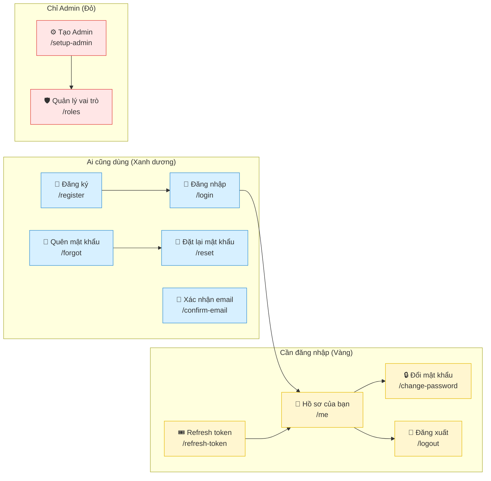

# Quản lý Tài khoản (Dành cho Học sinh lớp 5)

> 📜 Bản quyền © [2025] [Sok Kim Thanh] – Tài liệu này do [Sok Kim Thanh] biên soạn. Mọi quyền được bảo lưu. Không được sao chép hoặc sử dụng cho mục đích thương mại nếu không được phép.

Xin chào các bạn nhỏ! 👋

Mình là cô giáo trẻ, xinh đẹp và rất dễ thương, hôm nay sẽ cùng các em khám phá cách "quản lý tài khoản" trong một trang web. Mình nói thật nhẹ nhàng, dễ hiểu, như kể chuyện nhé. 🎒🌟

---

## Mục tiêu nhỏ

- Hiểu nhanh: đăng ký, đăng nhập, đổi mật khẩu, quên mật khẩu, xác nhận email, xem hồ sơ, vai trò, vé (token) và đăng xuất.
- Mỗi phần là một "nhiệm vụ" dễ làm theo, như trò chơi.

📚 Gợi ý: các em hãy đọc thật kỹ từng phần, xem sơ đồ, làm theo từng bước. Nếu có từ nào không hiểu, hãy xem phần "Từ mới" nhé.

---

## Một vài từ ngắn dễ hiểu

- **Identity**: giống như sổ ghi tên và mật khẩu của mọi người. 📒 (Ai là ai?)
- **Endpoint**: là địa chỉ để máy tính gửi yêu cầu, giống như cửa phòng. 🚪 (Ví dụ: /login)
- **Token (vé 🎟️)**: tấm vé nhỏ để vào phòng. Có vé thì được vào, không có vé sẽ không vào được đâu!
- **JWT**: một loại vé (token) thông minh, có in dấu đặc biệt để mọi người không làm giả.

---

## Sơ đồ nhanh (nhìn 1 phút hiểu luôn)

Sơ đồ này cho thấy các chức năng và ai có thể dùng chúng.



---

Bây giờ mình sẽ chia từng nhiệm vụ. Mỗi nhiệm vụ có các bước rất ngắn để các em làm theo.

---

## Nhiệm vụ 1: Đăng ký (Create Account) 👤

Câu chuyện: bạn muốn vào câu lạc bộ, phải đăng ký thẻ thành viên.

Bước 1: Nhập email và mật khẩu.  
Bước 2: Máy chủ lưu lại tên và mật khẩu.  
Bước 3: Bạn có tài khoản, có thể đăng nhập.

> 🔎 Giải thích đơn giản: Đăng ký giống như viết tên vào sổ. Khi cần, sổ sẽ kiểm tra tên và mật khẩu.

> ⚠️ Lưu ý: mật khẩu giống chìa khóa, không cho ai mượn.

Code mẫu (chỉ để tham khảo):

```csharp
// Tạo tài khoản mới
[HttpPost("register")]
public async Task<IActionResult> Register(RegisterRequest req)
{
    // Tạo người dùng mới với email và mật khẩu
    var user = new AspNetUser { UserName = req.Email, Email = req.Email };
    var result = await _userManager.CreateAsync(user, req.Password);
    if (!result.Succeeded)
    {
        // Nếu có lỗi, thông báo
        return BadRequest(result.Errors);
    }
    return Ok(); // Thành công
}
```

Bạn đã làm được gì: ✅ biết đăng ký giống như làm thẻ thành viên.

---

## Nhiệm vụ 2: Đăng nhập (Log in) 🔐

Câu chuyện: bạn đến cổng câu lạc bộ, đưa email + mật khẩu, nếu đúng bạn được vé để vào.

Bước 1: Nhập email và mật khẩu.  
Bước 2: Máy chủ kiểm tra.  
Bước 3: Nếu đúng, máy chủ trả về vé (token).

Ví dụ: token giống như vé vào rạp. Có vé mới được vào.

Code mẫu (làm gì):

```csharp
// Code này kiểm tra email và mật khẩu; nếu đúng thì trả về token (vé)
[HttpPost("login")]
public async Task<IActionResult> Login(LoginRequest req)
{
    var user = await _userManager.FindByEmailAsync(req.Email);
    if (user == null) return Unauthorized();

    var pwOk = await _userManager.CheckPasswordAsync(user, req.Password);
    if (!pwOk) return Unauthorized();

    // Tạo token (vé) và trả về
    var token = "<a JWT token string>"; // Trong thực tế, máy chủ sẽ tạo token an toàn
    return Ok(new { token });
}
```

Bạn đã làm được gì: ✅ biết đăng nhập giống như dùng chìa khóa.

---

## Nhiệm vụ 3: Đổi mật khẩu 🔑

Khi muốn thay chìa khóa cũ bằng chìa khóa mới.

Bước 1: Đăng nhập.  
Bước 2: Nhập mật khẩu cũ + mật khẩu mới.  
Bước 3: Máy chủ thay mật khẩu nếu mật khẩu cũ đúng.

Code mẫu (mục đích):

```csharp
// Code này đổi mật khẩu của người đang đăng nhập
[HttpPost("change-password")]
[Authorize]
public async Task<IActionResult> ChangePassword(ChangePasswordRequest req)
{
    var user = await _userManager.GetUserAsync(User);
    if (user == null) return Unauthorized();

    var res = await _userManager.ChangePasswordAsync(user, req.CurrentPassword, req.NewPassword);
    if (!res.Succeeded) return BadRequest(res.Errors);
    return Ok();
}
```

Bạn đã làm được gì: ✅ biết cách đổi mật khẩu an toàn.

---

## Nhiệm vụ 4: Quên mật khẩu & Đặt lại 📧🔑

Câu chuyện: mất chìa khóa thì xin chìa khóa tạm qua email.

Bước 1: Nhập email vào form "Quên mật khẩu".  
Bước 2: Máy chủ gửi email có link (tấm vé tạm).  
Bước 3: Nhấn link, đặt mật khẩu mới.

Code mẫu (làm gì):

```csharp
// Gửi email có link để đặt lại mật khẩu
[HttpPost("forgot-password")]
public async Task<IActionResult> ForgotPassword(ForgotPasswordRequest req)
{
    var user = await _userManager.FindByEmailAsync(req.Email);
    if (user == null) return Ok(); // không cho biết có hay không

    var token = await _userManager.GeneratePasswordResetTokenAsync(user);
    // Gửi token qua email (ví dụ: https://site/reset?token=...)
    await _emailSender.SendEmailAsync(user.Email, "Reset password", "Link đặt lại mật khẩu");
    return Ok();
}
```

Bạn đã làm được gì: ✅ hiểu cách xin link đặt lại mật khẩu.

---

## Nhiệm vụ 5: Xác nhận email 📩

Sau đăng ký, bạn nhấn link trong email để chứng minh email là của bạn.

Bước 1: Sau khi đăng ký, bạn nhận email chứa link xác nhận.  
Bước 2: Nhấn link để xác nhận.  
Bước 3: Ứng dụng ghi lại là email đã được xác thực.

Code mẫu (làm gì):

```csharp
// Xác nhận email của người dùng bằng token
[HttpPost("confirm-email")]
public async Task<IActionResult> ConfirmEmail(ConfirmEmailRequest req)
{
    var user = await _userManager.FindByIdAsync(req.UserId.ToString());
    if (user == null) return BadRequest();

    var res = await _userManager.ConfirmEmailAsync(user, req.Token);
    if (!res.Succeeded) return BadRequest(res.Errors);
    return Ok();
}
```

Bạn đã làm được gì: ✅ hiểu vì sao phải xác nhận email.

---

## Nhiệm vụ 6: Hồ sơ của bạn (Profile) 👤

Mục tiêu: xem và sửa thông tin của bạn như tên hiển thị.

Bước 1: Đăng nhập.  
Bước 2: Vào "Hồ sơ" để xem thông tin.  
Bước 3: Thay đổi tên hiển thị rồi lưu.

Code mẫu (làm gì):

```csharp
// Lấy thông tin người dùng đang đăng nhập
[HttpGet("me")]
[Authorize]
public async Task<IActionResult> Me()
{
    var user = await _userManager.GetUserAsync(User);
    var roles = await _userManager.GetRolesAsync(user);
    return Ok(new { user.Id, user.Email, user.UserName, Roles = roles });
}

// Cập nhật tên hiển thị
[HttpPut("me")]
[Authorize]
public async Task<IActionResult> UpdateProfile(UpdateProfileRequest req)
{
    var user = await _userManager.GetUserAsync(User);
    if (!string.IsNullOrWhiteSpace(req.UserName)) user.UserName = req.UserName;
    var res = await _userManager.UpdateAsync(user);
    if (!res.Succeeded) return BadRequest(res.Errors);
    return Ok();
}
```

Bạn đã làm được gì: ✅ biết cách xem và cập nhật hồ sơ cá nhân.

---

## Nhiệm vụ 7: Vai trò (Role) 🛡️

Mục tiêu: hiểu có người bình thường và người quản trị (Admin).

- **Vai trò** là nhãn gắn vào tài khoản: **Admin** (người quản lý) hoặc **Learner** (học sinh).
- Chỉ **Admin** mới được thay đổi vai trò hoặc tạo vai trò mới.

Code mẫu (làm gì):

```csharp
// Lấy danh sách vai trò (Admin only)
[HttpGet("roles")]
[Authorize(Roles = "Admin")]
public async Task<IActionResult> GetRoles() { /* chỉ Admin */ }

// Tạo vai trò mới (Admin only)
[HttpPost("roles")]
[Authorize(Roles = "Admin")]
public async Task<IActionResult> CreateRole(RoleRequest req) { /* chỉ Admin */ }
```

Bạn đã làm được gì: ✅ hiểu vai trò là gì và ai có quyền làm gì.

---

## Nhiệm vụ 8: Refresh token 🎟️

Mục tiêu: khi vé (token) hết hạn, bạn dùng "refresh token" để xin vé mới mà không cần đăng nhập lại.

So sánh: vé xem phim hết hạn, bạn đưa vé phụ để lấy vé mới.

Code ý tưởng (đơn giản):

```csharp
// Đổi refresh token lấy access token mới
[HttpPost("refresh-token")]
public async Task<IActionResult> RefreshToken(RefreshTokenRequest req)
{
    // Kiểm tra refresh token trong cơ sở dữ liệu
    // Nếu hợp lệ, tạo access token mới và trả về
    return Ok(new { accessToken = "<new token>", refreshToken = "<new refresh>" });
}
```

Bạn đã làm được gì: ✅ biết refresh token giúp không phải đăng nhập lại nhiều lần.

---

## Nhiệm vụ 9: Đăng xuất (Logout) 🚪

Mục tiêu: thu hồi vé (token) khi bạn muốn ra về.

Bước 1: Nhấn "Logout".  
Bước 2: Ứng dụng đánh dấu vé là không còn hiệu lực.  
Bước 3: Bạn phải đăng nhập lại để lấy vé mới.

Code mẫu (làm gì):

```csharp
// Hủy refresh token khi logout
[HttpPost("logout")]
[Authorize]
public async Task<IActionResult> Logout(LogoutRequest req)
{
    // Tìm refresh token và đánh dấu là bị thu hồi
    return Ok();
}
```

Bạn đã làm được gì: ✅ hiểu vì sao cần logout.

---

## Nhiệm vụ 10: Thiết lập Admin (1 lần) ⚙️

Mục tiêu: tạo người quản trị đầu tiên cho hệ thống.

Bước 1: Chạy chức năng tạo Admin (chỉ dùng 1 lần).  
Bước 2: Tạo tài khoản, gán vai trò **Admin**.  
Bước 3: Sau đó người này có thể quản lý vai trò và người dùng khác.

Code mẫu (làm gì):

```csharp
// Tạo tài khoản admin khi mới cài đặt (dùng 1 lần)
[HttpPost("setup-admin")]
public async Task<IActionResult> SetupAdmin(SetupAdminRequest req) { /* tạo admin */ }
```

Bạn đã làm được gì: ✅ hiểu Admin là ai.

---

## Muốn làm tiếp? 🛠️

- Các em có thể thử: tạo một trang HTML đơn giản với form đăng ký và đăng nhập.  
- Dùng Postman (hoặc trang web) gửi yêu cầu đến các địa chỉ /register, /login để thử.

---

## Ghi chú an toàn cho cha mẹ/gv

- Dặn trẻ không dùng mật khẩu thật khi thử.  
- Không chia sẻ email/mật khẩu công khai.

---

> 📜 Bản quyền © [2025] [Sok Kim Thanh] – Tài liệu do [Sok Kim Thanh] soạn. Không dùng cho mục đích thương mại.

Chúc các em học vui, cô yêu các em nhiều lắm! ❤️✨
