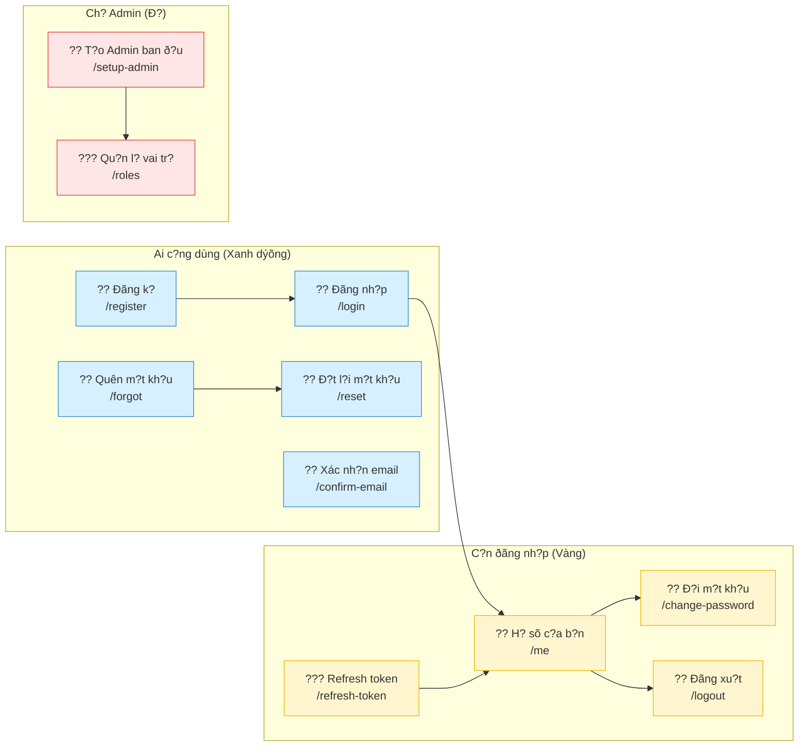

# Qu?n l? Tài kho?n (Dành cho H?c sinh l?p 5)

> ?? B?n quy?n © [2025] [Sok Kim Thanh] – Tài li?u này do [Sok Kim Thanh] biên so?n. M?i quy?n ðý?c b?o lýu. Không ðý?c sao chép ho?c s? d?ng cho m?c ðích thýõng m?i n?u không ðý?c phép.

?? M?c tiêu: Giúp b?n hi?u cách m?t ?ng d?ng web qu?n l? tài kho?n. Chúng ta bi?n m?i th? ph?c t?p thành nh?ng "nhi?m v?" vui nhý tr? chõi.

---

## Gi?i thi?u ng?n (dành cho b?n)

- B?n s? h?c cách: ðãng k?, ðãng nh?p, ð?i m?t kh?u, quên m?t kh?u, xác nh?n email, qu?n l? h? sõ, vai tr? (role), dùng vé (token) ð? vào ph?ng, và ðãng xu?t.
- M?i ph?n là m?t "nhi?m v?" (task). B?n làm xong s? th?y "B?n ð? làm ðý?c g?".

?? G?i ?: ð?c t?ng ph?n, xem sõ ð?, làm theo các bý?c. N?u b?n không hi?u t? nào, xem ph?n "T? m?i".

---

## T? m?i (gi?i thích d? hi?u)

- **Identity**: gi?ng nhý s? danh sách tên và m?t kh?u c?a m?i ngý?i. (Ai là ai?)
- **Endpoint**: là ð?a ch? trên internet mà b?n g?i yêu c?u (ví d?: /login). Gi?ng nhý c?a vào nhà.
- **Token (???)**: t?m vé ð? vào ph?ng. N?u b?n có vé, b?n ðý?c phép làm m?t s? vi?c.
- **JWT**: là m?t lo?i vé (token) thông minh, có ch? k? ð? không b? gi?.

---

## Sõ ð? minh h?a (d? hi?u)

Sõ ð? này cho th?y các ch?c nãng và ai có th? dùng chúng.



> ?? B?n quy?n © [2025] [Sok Kim Thanh] – Sõ ð? này do [Sok Kim Thanh] biên so?n. Không sao chép ho?c s? d?ng cho m?c ðích thýõng m?i n?u không ðý?c phép.

---

## Nhi?m v? 1: Ðãng k? (Create Account) ??

M?c tiêu: t?o m?t tài kho?n m?i, gi?ng nhý làm th? thành viên câu l?c b?.

Bý?c 1: Nh?p email và m?t kh?u.  
Bý?c 2: ?ng d?ng lýu tên và m?t kh?u.  
Bý?c 3: B?n ð? có tài kho?n, có th? ðãng nh?p.

> ?? Gi?i thích ðõn gi?n: Ðãng k? gi?ng nhý vi?t tên vào s?. Khi c?n, s? s? ki?m tra tên và m?t kh?u.

> ?? Lýu ?: m?t kh?u gi?ng ch?a khóa, không cho ai mý?n.

Code m?u (ch? ð? tham kh?o):

```csharp
// Code này t?o m?t tài kho?n m?i trong máy ch?
[HttpPost("register")]
public async Task<IActionResult> Register(RegisterRequest req)
{
    // T?o ngý?i dùng m?i v?i email và m?t kh?u
    var user = new AspNetUser { UserName = req.Email, Email = req.Email };
    var result = await _userManager.CreateAsync(user, req.Password);
    if (!result.Succeeded)
    {
        // N?u có l?i, thông báo
        return BadRequest(result.Errors);
    }
    return Ok(); // Thành công
}
```

B?n ð? làm ðý?c g?

- ? Bi?t ðãng k? gi?ng nhý ghi tên vào s?.
- ? Hi?u r?ng m?t kh?u là ch?a khóa riêng.

---

## Nhi?m v? 2: Ðãng nh?p (Log in) ??

M?c tiêu: vào ðý?c bên trong ?ng d?ng gi?ng nhý m? c?a b?ng ch?a khóa.

Bý?c 1: Nh?p email và m?t kh?u.  
Bý?c 2: ?ng d?ng ki?m tra s? xem có tên ðó và m?t kh?u ðúng không.  
Bý?c 3: N?u ðúng, ?ng d?ng cho b?n m?t "vé" (token) ð? ði ti?p.

Ví d?: token gi?ng nhý vé vào r?p. Có vé m?i ðý?c vào.

Code m?u (làm g?):

```csharp
// Code này ki?m tra email và m?t kh?u; n?u ðúng th? tr? v? token (vé)
[HttpPost("login")]
public async Task<IActionResult> Login(LoginRequest req)
{
    var user = await _userManager.FindByEmailAsync(req.Email);
    if (user == null) return Unauthorized();

    var pwOk = await _userManager.CheckPasswordAsync(user, req.Password);
    if (!pwOk) return Unauthorized();

    // T?o token (vé) và tr? v?
    var token = "<a JWT token string>"; // Trong th?c t?, máy ch? s? t?o token an toàn
    return Ok(new { token });
}
```

B?n ð? làm ðý?c g?

- ? Bi?t ðãng nh?p gi?ng nhý dùng ch?a khóa.
- ? Hi?u token là vé vào c?a.

---

## Nhi?m v? 3: Ð?i m?t kh?u ??

M?c tiêu: thay ch?a khóa c? b?ng ch?a khóa m?i.

Bý?c 1: B?n c?n ðãng nh?p.  
Bý?c 2: Nh?p m?t kh?u c? và m?t kh?u m?i.  
Bý?c 3: ?ng d?ng ki?m tra m?t kh?u c?, n?u ðúng, thay m?t kh?u.

Code m?u (m?c ðích):

```csharp
// Code này ð?i m?t kh?u c?a ngý?i ðang ðãng nh?p
[HttpPost("change-password")]
[Authorize]
public async Task<IActionResult> ChangePassword(ChangePasswordRequest req)
{
    var user = await _userManager.GetUserAsync(User);
    if (user == null) return Unauthorized();

    var res = await _userManager.ChangePasswordAsync(user, req.CurrentPassword, req.NewPassword);
    if (!res.Succeeded) return BadRequest(res.Errors);
    return Ok();
}
```

B?n ð? làm ðý?c g?

- ? Bi?t cách ð?i m?t kh?u an toàn.

---

## Nhi?m v? 4: Quên m?t kh?u & Ð?t l?i ????

M?c tiêu: n?u b?n quên ch?a khóa, b?n có th? xin vé m?i qua email.

Bý?c 1: Nh?n "Quên m?t kh?u" và nh?p email.  
Bý?c 2: Máy ch? g?i email có liên k?t ch?a token (t?m vé t?m).  
Bý?c 3: B?n nh?n link, nh?p m?t kh?u m?i.

So sánh vui: n?u m?t vé, b?n xin vé t?m qua email r?i ð?i vé m?i.

Code m?u (làm g?):

```csharp
// G?i email có link ð? ð?t l?i m?t kh?u
[HttpPost("forgot-password")]
public async Task<IActionResult> ForgotPassword(ForgotPasswordRequest req)
{
    var user = await _userManager.FindByEmailAsync(req.Email);
    if (user == null) return Ok(); // Không nói là email có hay không

    var token = await _userManager.GeneratePasswordResetTokenAsync(user);
    // G?i token qua email (ví d?: https://site/reset?token=...)
    await _emailSender.SendEmailAsync(user.Email, "Reset password", "Link ð?t l?i m?t kh?u");
    return Ok();
}
```

B?n ð? làm ðý?c g?

- ? Hi?u cách xin và dùng liên k?t ð? ð?t l?i m?t kh?u.

---

## Nhi?m v? 5: Xác nh?n email ??

M?c tiêu: ch?ng minh email là c?a b?n (gi?ng nhý ðóng d?u xác nh?n).

Bý?c 1: Sau khi ðãng k?, b?n nh?n email ch?a link xác nh?n.  
Bý?c 2: Nh?n link ð? xác nh?n.  
Bý?c 3: ?ng d?ng ghi l?i là email ð? ðý?c xác th?c.

Code m?u (làm g?):

```csharp
// Xác nh?n email c?a ngý?i dùng b?ng token
[HttpPost("confirm-email")]
public async Task<IActionResult> ConfirmEmail(ConfirmEmailRequest req)
{
    var user = await _userManager.FindByIdAsync(req.UserId.ToString());
    if (user == null) return BadRequest();

    var res = await _userManager.ConfirmEmailAsync(user, req.Token);
    if (!res.Succeeded) return BadRequest(res.Errors);
    return Ok();
}
```

B?n ð? làm ðý?c g?

- ? Hi?u v? sao ph?i xác nh?n email.

---

## Nhi?m v? 6: H? sõ c?a b?n (Profile) ??

M?c tiêu: xem và s?a thông tin c?a b?n nhý tên hi?n th?.

Bý?c 1: Ðãng nh?p.  
Bý?c 2: Vào "H? sõ" ð? xem thông tin.  
Bý?c 3: Thay ð?i tên hi?n th? r?i lýu.

Code m?u (làm g?):

```csharp
// L?y thông tin ngý?i dùng ðang ðãng nh?p
[HttpGet("me")]
[Authorize]
public async Task<IActionResult> Me()
{
    var user = await _userManager.GetUserAsync(User);
    var roles = await _userManager.GetRolesAsync(user);
    return Ok(new { user.Id, user.Email, user.UserName, Roles = roles });
}

// C?p nh?t tên hi?n th?
[HttpPut("me")]
[Authorize]
public async Task<IActionResult> UpdateProfile(UpdateProfileRequest req)
{
    var user = await _userManager.GetUserAsync(User);
    if (!string.IsNullOrWhiteSpace(req.UserName)) user.UserName = req.UserName;
    var res = await _userManager.UpdateAsync(user);
    if (!res.Succeeded) return BadRequest(res.Errors);
    return Ok();
}
```

B?n ð? làm ðý?c g?

- ? Bi?t cách xem và c?p nh?t h? sõ cá nhân.

---

## Nhi?m v? 7: Qu?n l? vai tr? (Role) ???

M?c tiêu: hi?u có ngý?i b?nh thý?ng và ngý?i qu?n tr? (Admin).

- **Vai tr?** là nh?n g?n vào tài kho?n: **Admin** (ngý?i qu?n l?) ho?c **Learner** (h?c sinh).
- Ch? **Admin** m?i ðý?c thay ð?i vai tr? ho?c t?o vai tr? m?i.

Code m?u (làm g?):

```csharp
// L?y danh sách vai tr? (Admin only)
[HttpGet("roles")]
[Authorize(Roles = "Admin")]
public async Task<IActionResult> GetRoles() { ... }

// T?o vai tr? m?i (Admin only)
[HttpPost("roles")]
[Authorize(Roles = "Admin")]
public async Task<IActionResult> CreateRole(RoleRequest req) { ... }
```

B?n ð? làm ðý?c g?

- ? Hi?u vai tr? là g? và ai có quy?n làm g?.

---

## Nhi?m v? 8: Refresh token (Gia h?n vé) ???

M?c tiêu: khi vé (token) h?t h?n, b?n dùng "refresh token" ð? xin vé m?i mà không c?n ðãng nh?p l?i.

So sánh: vé xem phim h?t h?n, b?n ðýa vé ph? ð? l?y vé m?i.

Code ? tý?ng (ðõn gi?n):

```csharp
// Ð?i refresh token l?y access token m?i
[HttpPost("refresh-token")]
public async Task<IActionResult> RefreshToken(RefreshTokenRequest req)
{
    // Ki?m tra refresh token trong cõ s? d? li?u
    // N?u h?p l?, t?o access token m?i và tr? v?
    return Ok(new { accessToken = "<new token>", refreshToken = "<new refresh>" });
}
```

B?n ð? làm ðý?c g?

- ? Bi?t refresh token giúp không ph?i ðãng nh?p l?i nhi?u l?n.

---

## Nhi?m v? 9: Ðãng xu?t (Logout) ??

M?c tiêu: thu h?i vé (token) khi b?n mu?n ra v?.

Bý?c 1: Nh?n "Logout".  
Bý?c 2: ?ng d?ng ðánh d?u vé là không c?n hi?u l?c.  
Bý?c 3: B?n ph?i ðãng nh?p l?i ð? l?y vé m?i.

Code m?u (làm g?):

```csharp
// H?y refresh token khi logout
[HttpPost("logout")]
[Authorize]
public async Task<IActionResult> Logout(LogoutRequest req)
{
    // T?m refresh token và ðánh d?u là b? thu h?i
    return Ok();
}
```

B?n ð? làm ðý?c g?

- ? Hi?u v? sao c?n logout.

---

## Nhi?m v? 10: Thi?t l?p Admin ban ð?u (Setup Admin) ??

M?c tiêu: t?o ngý?i qu?n tr? ð?u tiên cho h? th?ng.

Bý?c 1: Ch?y ch?c nãng t?o Admin (ch? dùng 1 l?n).  
Bý?c 2: T?o tài kho?n, gán vai tr? **Admin**.  
Bý?c 3: Sau ðó ngý?i này có th? qu?n l? vai tr? và ngý?i dùng khác.

Code m?u (làm g?):

```csharp
// T?o tài kho?n admin khi m?i cài ð?t (dùng 1 l?n)
[HttpPost("setup-admin")]
public async Task<IActionResult> SetupAdmin(SetupAdminRequest req) { ... }
```

B?n ð? làm ðý?c g?

- ? Hi?u vai tr? c?a admin và cách thi?t l?p ban ð?u.

---

## Mu?n làm ti?p? ???

- B?n có th? th?: t?o m?t trang HTML ðõn gi?n v?i form ðãng k? và ðãng nh?p.  
- Dùng Postman (ho?c trang web) g?i yêu c?u ð?n các ð?a ch? /register, /login ð? th?.

---

## Ghi chú an toàn cho ph? huynh/giáo viên

- Tài li?u này là ð? h?c và th? nghi?m. Không dùng các m?t kh?u th?t khi th?.  
- Luôn b?o v? thông tin cá nhân c?a h?c sinh.

---

## Gi?y phép & B?n quy?n

> ?? B?n quy?n © [2025] [Sok Kim Thanh] – Tài li?u này do [Sok Kim Thanh] biên so?n. M?i quy?n ðý?c b?o lýu. Không ðý?c sao chép ho?c s? d?ng cho m?c ðích thýõng m?i n?u không ðý?c phép.

Gi?y phép: CC BY-NC-SA 4.0 (Chi ti?t: https://creativecommons.org/licenses/by-nc-sa/4.0/)

---

Chúc b?n h?c vui! ??
