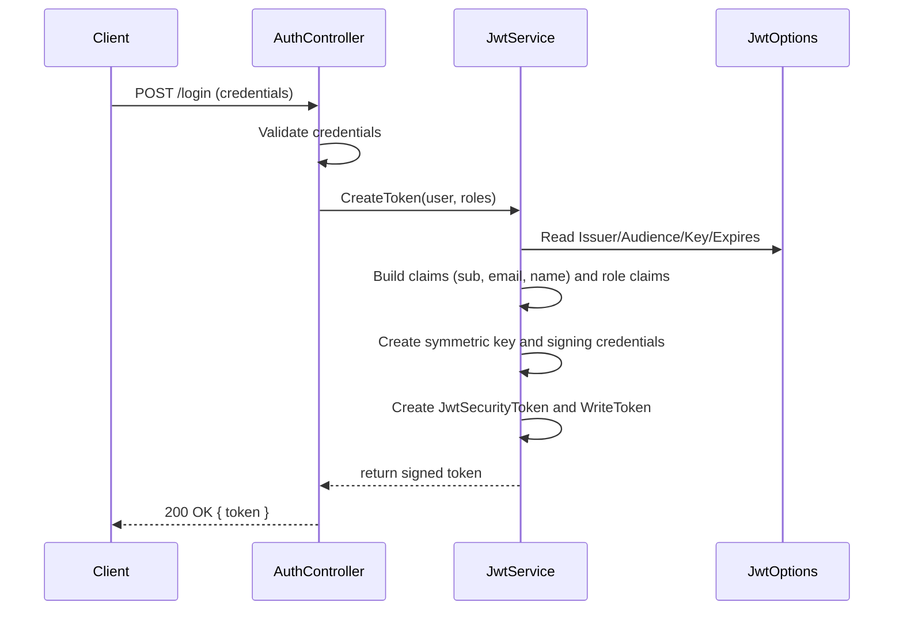
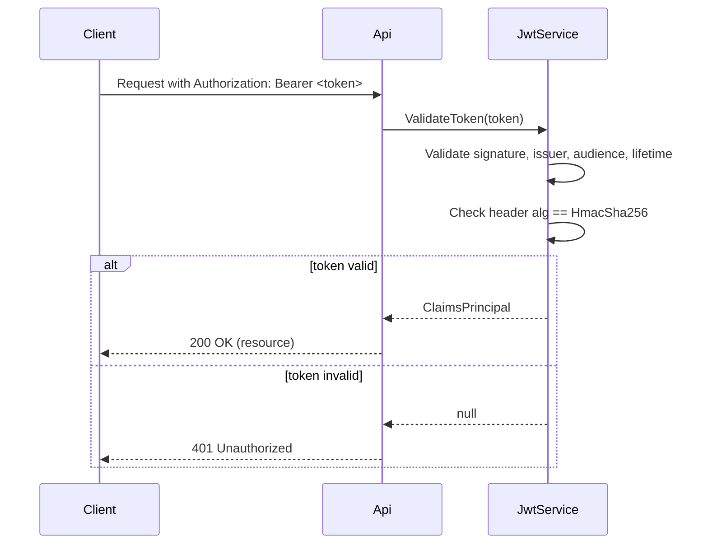

# Bài học: `JwtService` — Tạo và xác thực JWT trong LmsMini

## Mục tiêu
Tài liệu này giải thích chức năng của `JwtService` trong dự án `LmsMini`. Nội dung trình bày bằng tiếng Việt, bao gồm:
- Mô tả ngắn gọn class và trách nhiệm.
- Giải thích chi tiết cách `CreateToken` hoạt động (các bước và claim).
- Mô tả `ValidateToken`.
- Cấu hình `JwtOptions`, lưu ý bảo mật và ví dụ sử dụng ngắn.

---

## Tổng quan
`JwtService` chịu trách nhiệm tạo và xác thực JSON Web Tokens (JWT) dùng HMAC-SHA256. Service lấy cấu hình từ `JwtOptions` (issuer, audience, key, expires) để:
- Tạo token có các claim cơ bản (id, email, username) và claim vai trò (`ClaimTypes.Role`).
- Ký token bằng `SymmetricSecurityKey` dựa trên `JwtOptions.Key`.
- Xác thực token bằng `TokenValidationParameters` (kiểm tra issuer, audience, signature, thời hạn).

---

## Cấu trúc chính

### 1. Constructor
- Nạp `JwtOptions` từ DI (`IOptions<JwtOptions>`).
- Chuyển `Key` thành bytes (`Encoding.UTF8.GetBytes(_opts.Key)`) và tạo `IssuerSigningKey`.
- Thiết lập `TokenValidationParameters`:
  - `ValidateIssuer = true`, `ValidateAudience = true`, `ValidateLifetime = true`, `ValidateIssuerSigningKey = true`.
  - `ClockSkew = TimeSpan.Zero` (không cho phép dung sai mặc định 5 phút).

Lưu ý: nếu `JwtOptions.Key` không có giá trị, constructor sẽ ném ngoại lệ — đảm bảo cấu hình hợp lệ trước khi chạy.

### 2. `CreateToken(AspNetUser user, IEnumerable<string> roles)`
Mục đích: tạo chuỗi JWT đã ký chứa thông tin người dùng và vai trò.

Các bước thực hiện (giữ nguyên logic hiện tại):
1. Tạo danh sách claim cơ bản:
   - `sub` = `user.Id.ToString()` (claim `JwtRegisteredClaimNames.Sub`)
   - `email` = `user.Email` hoặc chuỗi rỗng (claim `JwtRegisteredClaimNames.Email`)
   - `name` = `user.UserName` hoặc chuỗi rỗng (claim `ClaimTypes.Name`)
2. Chuyển các role (tên role) thành claim `ClaimTypes.Role`:
   - Mỗi role -> `new Claim(ClaimTypes.Role, role)`
   - Nối các role claims vào danh sách claim hiện có (sử dụng `claims.Concat(...)`)
3. Tạo `SymmetricSecurityKey` từ `_opts.Key`:
   - `new SymmetricSecurityKey(Encoding.UTF8.GetBytes(_opts.Key))`
4. Tạo `SigningCredentials` với thuật toán HMAC SHA256:
   - `new SigningCredentials(key, SecurityAlgorithms.HmacSha256)`
5. Tạo `JwtSecurityToken` với:
   - `issuer` = `_opts.Issuer`
   - `audience` = `_opts.Audience`
   - `claims` = danh sách claims (bao gồm role claims)
   - `expires` = `DateTime.UtcNow.AddMinutes(_opts.ExpiresInMinutes)`
   - `signingCredentials` = creds
6. Trả về chuỗi token đã ký:
   - `new JwtSecurityTokenHandler().WriteToken(token)`

Ghi chú: logic tạo token giữ nguyên để tương thích với cấu hình JWT của ứng dụng.

### 3. `ValidateToken(string token)`
Mục đích: xác thực token và trả về `ClaimsPrincipal` nếu hợp lệ, ngược lại trả về `null`.

Cách hoạt động:
- Dùng `JwtSecurityTokenHandler.ValidateToken(token, _validationParams, out validatedToken)` để kiểm tra chữ ký, issuer, audience và thời hạn.
- Kiểm tra thêm rằng `validatedToken` là `JwtSecurityToken` và header `Alg` là `HmacSha256` (tránh tấn công thay đổi thuật toán).
- Nếu mọi kiểm tra hợp lệ -> trả về `ClaimsPrincipal`.
- Bất kỳ lỗi nào trong quá trình validate -> trả về `null`.

---

## Cấu hình (ví dụ)
Trong `appsettings.json` hoặc cấu hình tương đương, đặt `JwtOptions`:
- `Key`: chuỗi bí mật (luôn lưu ở nơi an toàn, đủ dài, ngẫu nhiên).
- `Issuer`: nhà phát hành (ví dụ: `"LmsMini"`).
- `Audience`: đối tượng nhận (ví dụ: `"LmsMiniClient"`).
- `ExpiresInMinutes`: thời lượng hiệu lực token.

Ví dụ (tóm tắt):
- Key nên được lưu trong biến môi trường hoặc Secret Manager, không commit vào kho mã.

---

## Ví dụ sử dụng nhanh
- Đăng ký DI:
  - `services.Configure<JwtOptions>(configuration.GetSection("Jwt"));`
  - `services.AddSingleton<IJwtService, JwtService>();`
- Tạo token:
  - `var token = jwtService.CreateToken(user, roles);`
- Xác thực token (server): `jwtservice.ValidateToken(token)` trả về `ClaimsPrincipal` hoặc `null`.

---

## Lưu ý bảo mật & vận hành
- Bảo vệ `JwtOptions.Key`: dùng Secret Manager hoặc biến môi trường trong production.
- Đảm bảo `Key` đủ dài và ngẫu nhiên (không dùng chuỗi ngắn).
- `ClockSkew = TimeSpan.Zero` giảm dung sai thời gian; cân nhắc nếu có client/server lệch giờ.
- Nếu cần thu hồi token, bổ sung `jti` claim và cơ chế blacklist/refresh token.
- Tránh đưa dữ liệu nhạy cảm vào claim.

---

## Kiểm thử
- Kiểm thử `CreateToken`:
  - Tạo token cho người dùng mẫu, giải mã (parse) token để kiểm tra các claim.
- Kiểm thử `ValidateToken`:
  - Test token hợp lệ, token hết hạn, token với `alg` khác, token bị sửa đổi.
- Unit test có thể dùng `JwtSecurityTokenHandler` để giải mã token và so sánh claims mong đợi.

---

## Có cần học không? Những điểm chính cần nhớ
Nên học. Đây là các điểm ngắn gọn, hữu dụng để nhớ khi làm việc với `JwtService`:

- Mục đích chính: `JwtService` tạo token (`CreateToken`) và xác thực token (`ValidateToken`).
- Claims cơ bản: `sub` (user id), `email`, `name` và các `ClaimTypes.Role` cho vai trò.
- Cách ký token: dùng `SymmetricSecurityKey` từ `JwtOptions.Key` và `SigningCredentials` với `HmacSha256`.
- Thời hạn token: `expires = DateTime.UtcNow.AddMinutes(_opts.ExpiresInMinutes)` — cấu hình qua `JwtOptions`.
- Validate token: kiểm tra issuer, audience, lifetime và signature thông qua `TokenValidationParameters`.
- Bảo mật khóa: lưu `JwtOptions.Key` an toàn (biến môi trường / Secret Manager) và đảm bảo đủ dài, ngẫu nhiên.
- Kiểm tra thuật toán: `ValidateToken` kiểm tra header `alg` = `HmacSha256` để chống tấn công thay đổi thuật toán.
- Clock skew: `ClockSkew = TimeSpan.Zero` loại bỏ dung sai mặc định; cần cân nhắc nếu hệ thống lệch giờ.
- Mở rộng khi cần: thêm `jti` cho khả năng thu hồi token hoặc triển khai refresh token khi cần.
- Tích hợp: đăng ký `JwtOptions` và `JwtService` trong DI để sử dụng trong controller/middleware.

Những điểm trên đủ để hiểu và tùy chỉnh `JwtService` trong hầu hết các trường hợp. Nếu cần checklist kiểm tra cấu hình hoặc ví dụ test unit, có thể thêm vào tài liệu.

---

## Sơ đồ minh họa (Mermaid sequence)
Dưới đây là hai sơ đồ sequence Mermaid, mỗi sơ đồ mô tả chi tiết luồng tương tác cho một thao tác chính.

### CreateToken (sequence)
CreateToken: "Khi client đăng nhập, controller kiểm chứng, gọi JwtService tạo token. JwtService lấy cấu hình issuer, audience, key và thời hạn, dựng claim chủ thể sub cùng email và tên, biến danh sách roles thành các role claim, tạo khoá đối xứng từ key và credentials HMAC SHA256, ghép tất cả vào JwtSecurityToken, ký và trả chuỗi token đã ký về cho controller — controller trả token cho client." 

### ValidateToken (sequence)
ValidateToken: "Client gửi request kèm Bearer token, API gọi JwtService xác thực; handler kiểm tra chữ ký, issuer, audience và thời hạn, thêm bước kiểm tra header alg là HmacSha256; nếu mọi thứ hợp lệ trả về ClaimsPrincipal để API sử dụng, còn không thì trả null và API trả 401." 

---

Tài liệu ngắn này nhằm giúp nắm nhanh cách `JwtService` hoạt động trong `LmsMini`. Nếu cần, có thể mở rộng bằng ví dụ cụ thể với mã gọi thực tế hoặc test unit mẫu.